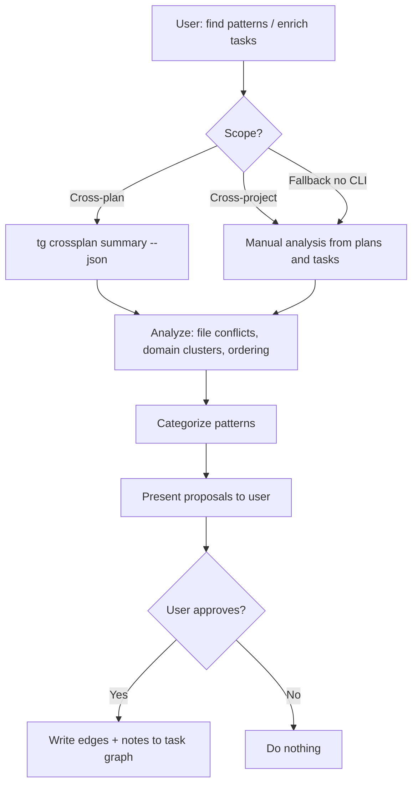

# Meta Skill

**Lead documentation:** See [docs/leads/meta.md](../../docs/leads/meta.md).

Describes how to enrich the task graph with **cross-plan edges** and **task notes**: propose relationships and notes from cross-plan (or cross-project) analysis, then write to the graph only after user approval.

## When to use

- User says "find patterns", "enrich tasks", or asks for cross-plan task analysis.
- User says "cross-project patterns" when multiple projects are loaded.
- You have multiple plans in the task graph and want to surface file conflicts, domain clusters, architectural opportunities, or execution ordering.
- Run **after** risk (cross-plan risk assessment) when both risk and enrichment are needed.

## Scope

| User intent                      | Scope                             |
| -------------------------------- | --------------------------------- |
| "find patterns" / "enrich tasks" | Cross-plan (current project)      |
| "cross-project patterns"         | Cross-project (multiple projects) |
| After risk                       | Cross-plan with risk context      |

## Architecture

- **You (orchestrator / meta lead)**: Gathers data, analyzes patterns, presents proposals.
- **Sub-agents**: None. This lead runs analysis directly using crossplan CLI or manual plan reading.

## Permissions

- **Lead**: read until approval; write (edges + notes) only after explicit user approval
- **Rule**: NEVER write edges or notes without user approval. Present proposals first.

## Decision tree

## Enrichment workflow

### 1. Gather cross-plan (or cross-project) data

Use whatever is available in the environment:

- **Cross-plan (default):** If the cross-plan CLI is available, run `pnpm tg crossplan summary --json` (or equivalent) to get domains, skills, file overlaps, and proposed edges across plans. Parse the JSON for the steps below.
- **Cross-project (extended):** When multiple projects are loaded, use manual analysis from plan files and task status — no cross-project CLI; gather plans/tasks from each project and compare.
- **Fallback (no CLI):** From plan/task context (e.g. `tg plan list`, `tg status --tasks`, or docs), manually identify tasks across plans that share files, domains, or areas of work.

### 2. Analyze and categorize

From the data, identify:

| Pattern                         | What to look for                                                                                            | Proposed action                                                                                                                |
| ------------------------------- | ----------------------------------------------------------------------------------------------------------- | ------------------------------------------------------------------------------------------------------------------------------ |
| **File conflicts**              | Tasks from different plans touching the same files                                                          | Propose `blocks` edges (e.g. "Plan A task X blocks Plan B task Y on file F") with a short rationale.                           |
| **Domain clusters**             | Tasks sharing domains across plans                                                                          | Propose `relates` edges between tasks that share a domain.                                                                     |
| **Architectural opportunities** | Tasks in multiple plans that could share a common abstraction (e.g. same area of code, same kind of change) | Propose `relates` edges and/or suggest a note on one or both tasks (e.g. "Consider shared abstraction with task T in plan P"). |
| **Ordering opportunities**      | Which plans (or plan roots) should execute first to unblock others                                          | Present ordering recommendations; optionally propose `blocks` edges to encode dependencies.                                    |

### 3. Present proposals to the user

- List each proposed edge (blocks or relates) with: task IDs, plan names, and rationale.
- List any suggested task notes (which task, note text).
- **Do not write to the task graph yet.** Wait for explicit user approval (e.g. "apply", "go ahead", "write them").

### 4. On approval only — write to the task graph

- **Edges:** Use the taskgraph CLI to add each approved edge:
  - `pnpm tg edge add <fromTaskId> <type> <toTaskId> [--reason "..."]`
  - `<type>` is `blocks` or `relates`; `fromTaskId` is the blocking/source task, `toTaskId` is the blocked/target task.
- **Task notes:** Use `pnpm tg note <taskId> --msg "..."` for each approved note (optionally `--agent <name>`).

If the user does not approve, do not run any `tg edge add` or `tg note` commands.

## Important

- **Never write without user approval.** This skill can create incorrect cross-plan dependencies; every batch of edges and notes must be confirmed by the user before writing.
- This skill is **skills-only**: it describes how to enrich the graph from cross-plan analysis. It does not define or require a specific cross-plan CLI or tests; use whatever data source (crossplan commands or manual analysis) is available.

## Reference

- **Lead doc:** [docs/leads/meta.md](../../docs/leads/meta.md)
