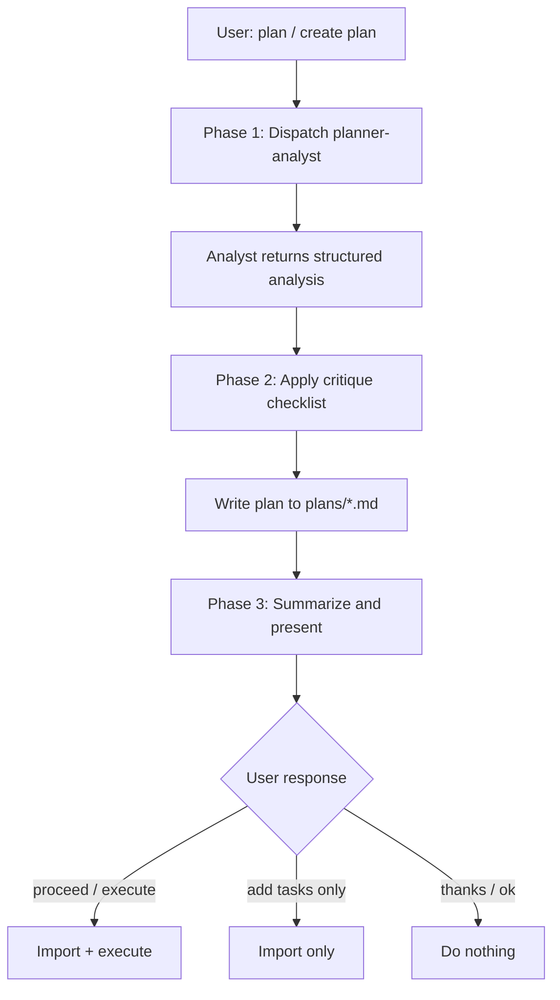

# Plan — Rich Plan Creation

**Lead documentation:** See [docs/leads/planner-analyst.md](docs/leads/planner-analyst.md).

## Architecture

- **You (orchestrator / planner lead)**: Dispatches analyst, applies critique checklist, writes the plan, presents for review.
- **Sub-agents**:

  | Agent | Purpose | Permission |
  |-------|---------|------------|
  | planner-analyst | Gathers codebase context and rough task breakdown | read-only |

The analyst gathers facts; the orchestrator owns architecture, dependencies, and task design.

## Permissions

- **Lead**: read-write (writes plan file to plans/)
- **Propagation**: Planner-analyst MUST use readonly=true (model="fast", subagent_type="explore").
- **Rule**: Analyst does not write files. Only the orchestrator writes the plan.

## Decision tree



When this skill is invoked, run the full two-phase planning workflow. Do not shortcut or skip the analyst phase.

## Phase 1: Dispatch Planner-Analyst

**Mandatory.** Do not write a plan without analyst output.

1. Read `.cursor/agents/planner-analyst.md` for the prompt template.
2. Run `pnpm tg status --tasks` to capture current task list (full; not limited to 3).
3. Build the analyst prompt:
   - `{{REQUEST}}` = the user's feature/change request
   - Include `tg status --tasks` output so the analyst can reference the full task list
   - Include `{{LEARNINGS}}` from the agent file's `## Learnings` section if non-empty
4. Dispatch via Task tool (`model="fast"`, `subagent_type="explore"`) with description "Planner analyst: gather context for plan".
5. Wait for the analyst's structured analysis (relevant files, existing data, patterns, risks, rough breakdown).

## Phase 2: Write the Plan

Use the analyst's output as input. **You own architecture, dependencies, and task design** — the analyst gathers facts, you do the reasoning.

### Orchestrator critique checklist

Before writing, work through each item:

- **Existing data first**: Can metrics/insights be derived from what already exists (timestamps, event counts, existing fields) before designing new capture?
- **Dependency minimization**: For each proposed `blockedBy`, ask "can the downstream task work without the upstream?" Prefer wide graphs over deep chains.
- **Concrete metrics**: If the request is qualitative ("efficiency", "performance"), define measurable terms. What gets measured? What thresholds?
- **Task specificity**: Each task must be concrete enough for a fast sub-agent. No "heuristics e.g. ..." or "optionally ..." — decide in the plan.
- **Resolve open questions**: Architectural choices decided here, not left for implementers. If genuinely undecidable, create an explicit investigate task.
- **Test ownership**: Assign tests to tasks (in intent or as dedicated test tasks). Don't list plan-level `tests` without a task that owns them.
- **Parallel-ready**: Plans MUST have ≥2 tasks with no `blockedBy`. Docs, tests, and independent features rarely need to block on each other.

### File naming

`plans/yy-mm-dd_slug_name.md` — two-digit year, date, underscores, no spaces or colons.

### YAML frontmatter structure

```yaml
---
name: Plan Name
overview: Single-line description of scope and goal.
fileTree: |
  src/
  ├── module/
  │   ├── file.ts              (modify)
  │   └── new-file.ts          (create)
  __tests__/
  └── module/
      └── file.test.ts         (create)
risks:
  - description: What could go wrong
    severity: medium
    mitigation: How we address it
tests:
  - "Test description assigned to a specific task"
todos:
  - id: kebab-case-id
    content: "Task title (under 255 chars)"
    agent: implementer
    intent: |
      Detailed scope, rationale, file/function references.
      Concrete enough for a fast sub-agent.
    suggestedChanges: |
      Optional snippet or pointer for the agent.
    changeType: create
  - id: second-task
    content: "Another task"
    agent: implementer
    blockedBy: [kebab-case-id]
    intent: |
      What this task does and why.
    changeType: modify
isProject: false
---
```

Required per-todo fields: `id`, `content`, `agent`, `intent`.
Optional: `blockedBy`, `suggestedChanges`, `changeType`, `docs`, `skill`.

### Markdown body (below closing `---`)

1. **Analysis** — Why this approach; what was explored or rejected.
2. **Dependency graph** — Tree format showing execution waves:

   ```
   Parallel start (N unblocked):
     ├── task-id-1 (brief description)
     └── task-id-2 (brief description)

   After task-id-1:
     └── task-id-3 (brief description)

   After all above:
     └── integration-tests
   ```

3. **Proposed changes** — Detailed code snippets or logic for complex tasks.
4. **Mermaid diagrams** — For data flows, state machines (supplements tree graph).
5. **Open questions** — Unresolved items that may affect execution.
6. **Original prompt** — End with:
   ```xml
   <original_prompt>
   The user's original request...
   </original_prompt>
   ```

### YAML robustness rules

- `name`: No em dashes (—); use hyphens or "and".
- `overview`: Single line. No `|` multiline. No arrows (→); use "to" or "->".
- `blockedBy`: Single-line array syntax: `blockedBy: [id-1, id-2]`.
- If import fails, move `fileTree`, `risks`, `tests`, `intent`, `suggestedChanges` to the markdown body and keep frontmatter minimal (`id`, `content`, `status`, `blockedBy` only).

## Phase 3: Validate and Present

1. Summarize the plan to the user.
2. **Pause and wait for review.** Do not import or execute until the user responds.
3. Interpret the user's response:

| User says                            | Action                                                                                  |
| ------------------------------------ | --------------------------------------------------------------------------------------- |
| proceed, go ahead, execute, run it   | Import with `pnpm tg import plans/<file> --plan "<Name>" --format cursor`, then execute |
| just add the tasks, add to taskgraph | Import only; do not execute                                                             |
| thanks, looks good, ok               | Do nothing (acknowledgement only)                                                       |

### Import command

```bash
pnpm tg import plans/<file> --plan "<Plan Name>" --format cursor
```

If import fails, read the error (js-yaml parse cause), fix the frontmatter, and retry.
