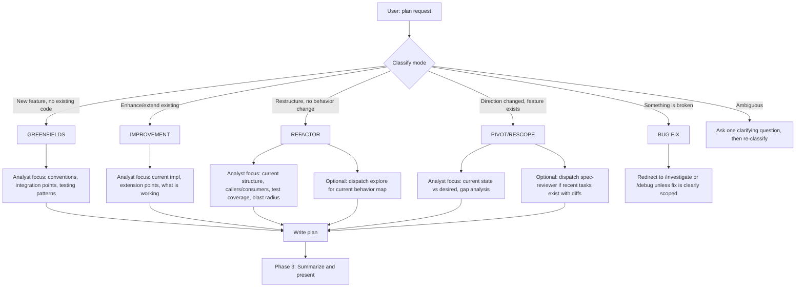

# Plan — Rich Plan Creation

**Lead documentation:** See [docs/leads/planner-analyst.md](docs/leads/planner-analyst.md). **Shared learnings for sub-agents:** [.cursor/agent-utility-belt.md](../../agent-utility-belt.md).

## Architecture

- **You (orchestrator / planner lead)**: Classifies request mode, dispatches analyst (and optional mode-specific sub-agents), applies critique checklist, writes the plan, presents for review.
- **Sub-agents**:

  | Agent           | Purpose                                           | Permission | Model            |
  | --------------- | ------------------------------------------------- | ---------- | ---------------- |
  | planner-analyst | Gathers codebase context and rough task breakdown | read-only  | default (Sonnet) |
  | spec-reviewer   | Assesses current impl vs intent (Pivot mode only) | read-only  | default (Sonnet) |
  | explore         | Maps current behavior (Pivot/Refactor modes)      | read-only  | fast             |

The analyst gathers facts; the orchestrator owns architecture, dependencies, and task design.

## Permissions

- **Lead**: read-write (writes plan file to plans/)
- **Propagation**: Planner-analyst MUST use readonly=true, subagent_type="explore". Do NOT pass model="fast" — analyst uses the session model (Sonnet) for reasoning quality.
- **Rule**: Analyst does not write files. Only the orchestrator writes the plan.

## Mode Classification (do this before Phase 1)

Before dispatching the analyst, classify the request into one of these modes. The mode shapes the analyst prompt focus and whether additional sub-agents run.

| Mode              | When                                                                                | Keywords / signals                                                                                                                     |
| ----------------- | ----------------------------------------------------------------------------------- | -------------------------------------------------------------------------------------------------------------------------------------- |
| **Greenfields**   | New feature or subsystem with no existing code                                      | "add", "build", "create", "implement" + new area                                                                                       |
| **Improvement**   | Enhancing or extending an existing feature                                          | "improve", "enhance", "extend", "update", "upgrade"                                                                                    |
| **Refactor**      | Structural change without behavior change                                           | "refactor", "restructure", "clean up", "simplify", "rename"                                                                            |
| **Pivot/Rescope** | Feature exists but direction has changed; tasks already done but result isn't right | "rescope", "this isn't right", "instead of", "change X to Y", tasks already done but UX/behavior is wrong                              |
| **Bug fix**       | Something is broken                                                                 | "fix", "broken", "not working", "bug", "error" → **redirect to `/investigate` or `/debug`** unless the fix is small and clearly scoped |
| **Unclear**       | Request is ambiguous                                                                | Ask one clarifying question before dispatching analyst                                                                                 |


```mermaid
flowchart TD
    A[User: plan request] --> B{Classify mode}
    B -->|New feature, no existing code| C[GREENFIELDS]
    B -->|Enhance/extend existing| D[IMPROVEMENT]
    B -->|Restructure, no behavior change| E[REFACTOR]
    B -->|Direction changed, feature exists| F[PIVOT/RESCOPE]
    B -->|Something is broken| G[BUG FIX]
    B -->|Ambiguous| H[Ask one clarifying question, then re-classify]

    G --> G2[Redirect to /investigate or /debug unless fix is clearly scoped]

    C --> I[Analyst focus: conventions, integration points, testing patterns]
    D --> J[Analyst focus: current impl, extension points, what is working]
    E --> K[Analyst focus: current structure, callers/consumers, test coverage, blast radius]
    F --> L[Analyst focus: current state vs desired, gap analysis]

    E --> M[Optional: dispatch explore for current behavior map]
    F --> N[Optional: dispatch spec-reviewer if recent tasks exist with diffs]

    I --> O[Write plan]
    J --> O
    K --> O
    L --> O
    M --> O
    N --> O

    O --> P[Phase 3: Summarize and present]
```

### Mode-specific analyst focus (inject into analyst prompt as `{{MODE_FOCUS}}`)

**Greenfields**: Focus on conventions to follow, integration points in the codebase, testing patterns, and any similar existing features the new one should mirror. Identify what does NOT exist yet that must be built.

**Improvement**: Focus on the current implementation: what already works, what the extension points are, what the pain points are. Map callers and consumers. Identify what would break.

**Refactor**: Focus on current structure, every callsite and consumer of the code being refactored, test coverage (is behavior locked in?), and blast radius. Flag if tests are insufficient to safely refactor.

**Pivot/Rescope**: Focus on "current state vs desired state." Describe what exists and how it behaves today. Identify the gap between current behavior and the desired directive. Note which existing tasks are done that shipped the wrong behavior.

### Phase 1: Dispatch Planner-Analyst

**Mandatory.** Do not write a plan without analyst output.

1. Read `.cursor/agents/planner-analyst.md` for the prompt template.
2. Run `pnpm tg status --tasks` to capture current task list (full; not limited to 3).
3. Build the analyst prompt:
   - `{{REQUEST}}` = the user's feature/change request
   - `{{MODE}}` = classified mode (Greenfields / Improvement / Refactor / Pivot / etc.)
   - `{{MODE_FOCUS}}` = mode-specific focus paragraph from the table above
   - Include `tg status --tasks` output so the analyst can reference the full task list
   - Include `{{LEARNINGS}}` from the agent file's `## Learnings` section if non-empty
4. Dispatch via Task tool (`subagent_type="explore"`) — do NOT pass `model="fast"`; analyst uses session model.
5. For **Pivot/Rescope** or **Refactor** modes: optionally dispatch an additional sub-agent in parallel with the analyst:
   - **Pivot**: If there are recent done tasks in the relevant area, dispatch spec-reviewer (with `readonly=true`) asking "Does the current implementation match [desired directive]?" to surface the gap.
   - **Refactor**: Dispatch explore with "Map all callers and consumers of [target area]; list files that import or call the modules being refactored."
6. Wait for the analyst's structured analysis (relevant files, existing data, patterns, risks, rough breakdown).

### Phase 2 additions per mode

**Refactor plans** must:

- Each task must preserve observable behavior (tests must still pass after each task)
- Include a "behavior contract" task at the start: add/verify tests that lock in current behavior before any structural changes

**Pivot/Rescope plans** must include in the plan body:

- **Current state** — What exists and how it behaves today (from analyst + spec-reviewer)
- **Desired state** — What the user said it should do
- **Gaps** — The delta between current and desired, task by task

## Phase 2: Write the Plan

Use the analyst's output as input. **You own architecture, dependencies, and task design** — the analyst gathers facts, you do the reasoning.

### Orchestrator critique checklist

Before writing, work through each item:

- **Existing data first**: Can metrics/insights be derived from what already exists (timestamps, event counts, existing fields) before designing new capture?
- **Dependency minimization**: For each proposed `blockedBy`, ask "can the downstream task work without the upstream?" Prefer wide graphs over deep chains.
- **Concrete metrics**: If the request is qualitative ("efficiency", "performance"), define measurable terms. What gets measured? What thresholds?
- **Task specificity**: Each task must be concrete enough for a fast sub-agent. No "heuristics e.g. ..." or "optionally ..." — decide in the plan.
- **Resolve open questions**: Architectural choices decided here, not left for implementers. If genuinely undecidable, create an explicit investigate task.
- **Test ownership**: Assign tests to tasks (in intent or as dedicated test tasks). Don't list plan-level `tests` without a task that owns them.
- **Parallel-ready**: Plans MUST have ≥2 tasks with no `blockedBy`. Docs, tests, and independent features rarely need to block on each other.

### File naming

`plans/yy-mm-dd_slug_name.md` — two-digit year, date, underscores, no spaces or colons.

### YAML frontmatter structure

```yaml
---
name: Plan Name
overview: Single-line description of scope and goal.
fileTree: |
  src/
  ├── module/
  │   ├── file.ts              (modify)
  │   └── new-file.ts          (create)
  __tests__/
  └── module/
      └── file.test.ts         (create)
risks:
  - description: What could go wrong
    severity: medium
    mitigation: How we address it
tests:
  - "Test description assigned to a specific task"
todos:
  - id: kebab-case-id
    content: "Task title (under 255 chars)"
    agent: implementer
    intent: |
      Detailed scope, rationale, file/function references.
      Concrete enough for a fast sub-agent.
    suggestedChanges: |
      Optional snippet or pointer for the agent.
    changeType: create
  - id: second-task
    content: "Another task"
    agent: implementer
    blockedBy: [kebab-case-id]
    intent: |
      What this task does and why.
    changeType: modify
isProject: false
---
```

Required per-todo fields: `id`, `content`, `agent`, `intent`.
Optional: `blockedBy`, `suggestedChanges`, `changeType`, `docs`, `skill`.

### Markdown body (below closing `---`)

1. **Analysis** — Why this approach; what was explored or rejected.
2. **Dependency graph** — Tree format showing execution waves:

   ```
   Parallel start (N unblocked):
     ├── task-id-1 (brief description)
     └── task-id-2 (brief description)

   After task-id-1:
     └── task-id-3 (brief description)

   After all above:
     └── integration-tests
   ```

3. **Proposed changes** — Detailed code snippets or logic for complex tasks.
4. **Mermaid diagrams** — For data flows, state machines (supplements tree graph).
5. **Open questions** — Unresolved items that may affect execution.
6. **Original prompt** — End with:
   ```xml
   <original_prompt>
   The user's original request...
   </original_prompt>
   ```

### YAML robustness rules

- `name`: No em dashes (—); use hyphens or "and".
- `overview`: Single line. No `|` multiline. No arrows (→); use "to" or "->".
- `blockedBy`: Single-line array syntax: `blockedBy: [id-1, id-2]`.
- If import fails, move `fileTree`, `risks`, `tests`, `intent`, `suggestedChanges` to the markdown body and keep frontmatter minimal (`id`, `content`, `status`, `blockedBy` only).

## Phase 3: Validate and Present

1. Summarize the plan to the user.
2. Ask: **Confirm loading initiative, projects and tasks into tg?** and present options below. **Yes (option 2) is the default:** if the user sends an empty reply (Enter with nothing) or a space, treat as Yes — load into tg only. The agent cannot detect raw keypresses; it only sees the message content, so "empty message" or "space" is how the user signals default.
3. **Pause and wait for review.** Do not import or execute until the user responds.
4. Interpret the user's response. **User may reply with the number only (e.g. 1, 2, or 3).** Option 2 is the suggested next thing (load into tg).

| #   | User says                             | Action                                                                                  |
| --- | ------------------------------------- | --------------------------------------------------------------------------------------- |
| 1   | proceed, go ahead, execute, run it    | Import with `pnpm tg import plans/<file> --plan "<Name>" --format cursor`, then execute |
| 2   | yes, load into tg, just add the tasks | Import only; do not execute. **Default:** empty reply or space = this option.           |
| 3   | no, thanks, looks good, do nothing    | Do nothing (acknowledgement only)                                                       |

### Import command

```bash
pnpm tg import plans/<file> --plan "<Plan Name>" --format cursor
```

If import fails, read the error (js-yaml parse cause), fix the frontmatter, and retry.
