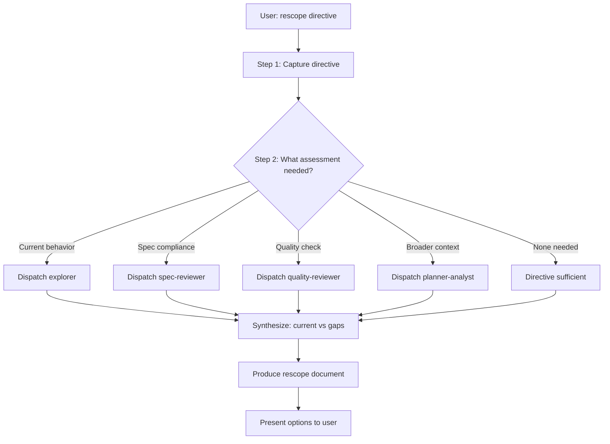

# Rescope

**Lead documentation:** See [docs/leads/rescope.md](../../../docs/leads/rescope.md).

Clarifies **desired functionality** when work has shipped but behavior is not what the user wants. You act as a **product manager**: take the user's directive, assess current state vs desired state, and produce a clear scope and optional follow-up plan.

## When to use

- User says **rescope**, **clarify scope**, or **this isn't quite right**.
- User gives a **directive** describing how the system (or a feature) should behave.
- Tasks are **already done** (or partially done) and the user is refining requirements.

## Your role

- **Product manager**: Interpret the user's directive; separate "what we have" from "what we want"; avoid implementation details until scope is clear.
- **Orchestrator**: Decide which sub-agents (if any) to use to assess current behavior and gaps. Synthesize their output into a scope document and optional plan.

## Architecture

- **You (orchestrator / rescope lead)**: Acts as product manager. Captures directive, decides assessment needs, synthesizes findings.
- **Sub-agents** (all optional, dispatched based on need):

  | Agent | Purpose | Permission | When |
  |-------|---------|------------|------|
  | explorer | Map current implementation and behavior | read-only | Need to see what exists |
  | spec-reviewer | Check if implementation matches intent | read-only | Have task + diff |
  | quality-reviewer | Check implementation quality | read-only | Spec is fine; need quality check |
  | planner-analyst | Broader codebase context for plan | read-only | Directive implies multi-task plan |

## Permissions

- **Lead**: read-only (clarifies functionality; does not write code or run tg start/done)
- **Propagation**: All sub-agents read-only. No implementer in this skill.
- **Constraint**: Stay in PM role. Do not write code.

## Decision tree



## Workflow

### Step 1 — Capture the directive

From the user's message, extract:

- **Desired behavior** — What the user says the system (or feature) should do. Use their words; avoid reinterpreting.
- **Scope anchor** — What area this applies to (e.g. "tg status --tasks", "context budget", "plan import").
- **Constraints or preferences** — Any "must" / "must not" / "should" the user stated.

Write a short **directive summary** (2–4 sentences) that you will use when briefing sub-agents or writing the rescope output.

### Step 2 — Decide what to assess

Choose what you need to know before proposing next steps:

| Need                                              | Sub-agent to use     | When                                                             |
| ------------------------------------------------- | -------------------- | ---------------------------------------------------------------- |
| What code/UX exists and how it behaves            | **explorer**         | You need a fast map of implementation and behavior.              |
| Whether recent implementation matches spec/intent | **spec-reviewer**    | You have a task + diff and want "does this match intent?"        |
| Whether implementation quality is sufficient      | **quality-reviewer** | Spec is fine; you want quality/patterns/tests checked.           |
| Broader codebase context before defining tasks    | **planner-analyst**  | You need discovery for a plan (e.g. "rescope status dashboard"). |

You may use **none** (directive is enough to write scope), **one**, or **several** in sequence. Do not use implementer or investigator unless the rescope explicitly becomes an investigate/work flow.

### Step 3 — Run sub-agents (if any)

- **Explorer**: Build a prompt that asks for "what exists and how it behaves" in the scope anchor area. Use `mcp_task` with `subagent_type` **explore**; pass the directive summary and scope anchor.
- **Planner-analyst**: Use when the directive implies a multi-task plan. Build the prompt from `.cursor/agents/planner-analyst.md` with the user's directive as `{{REQUEST}}`; dispatch with **explore** or **generalPurpose**.
- **Spec-reviewer** / **quality-reviewer**: Use when you have a concrete task and diff (e.g. a recent implementer run). Read `.cursor/agents/spec-reviewer.md` or `.cursor/agents/quality-reviewer.md`, build prompt with task context + diff, and dispatch. Prefer spec-reviewer first if you care about "does this match intent?".

Synthesize sub-agent outputs into: **current state**, **gaps vs directive**, **ambiguities**.

### Step 4 — Produce rescope output

Output a short document following the **Output format** below.

If you used planner-analyst and have a task list, you can append a **Draft tasks** section (titles + one-line intents) and suggest importing a plan and running `/work` or creating a Cursor plan for review.

## Output format

```markdown
## Rescope: [Scope anchor or feature name]

### Directive (from you)

[Your 2–4 sentence summary of what the user said the system should do.]

### Current state (assessed)

[What exists and how it behaves today. From codebase knowledge and/or sub-agent reports.]

### Gaps and clarifications

- **Gap 1:** [Desired X; current behavior Y.]
- **Gap 2:** …
- **Clarifications:** [Questions for the user if anything is ambiguous.]

### Recommended next steps

- [ ] [Option A: e.g. "Update plan/tasks for … and run /work."]
- [ ] [Option B: e.g. "Create a small plan: task 1 … task 2 …"]
- [ ] [Option C: e.g. "No code change; document the intended behavior in …."]
```

## Rules

- **Stay in role:** You are clarifying functionality, not implementing. Do not write code or run `tg start`/`tg done` unless the user explicitly asks to execute.
- **Sub-agents:** Use only explorer, planner-analyst, spec-reviewer, quality-reviewer as needed. No implementer in the rescope skill itself.
- **Directive first:** The user's words define "desired"; your and sub-agents' output define "current" and "gaps."
- **One scope per run:** One rescope output per user directive. If the user gives multiple areas, either split into sections or run rescope once per area and summarize.

## Reference

- **Lead:** [docs/leads/rescope.md](../../../docs/leads/rescope.md)
- **Sub-agents:** [explorer](../../agents/explorer.md), [planner-analyst](../../agents/planner-analyst.md), [spec-reviewer](../../agents/spec-reviewer.md), [quality-reviewer](../../agents/quality-reviewer.md)
