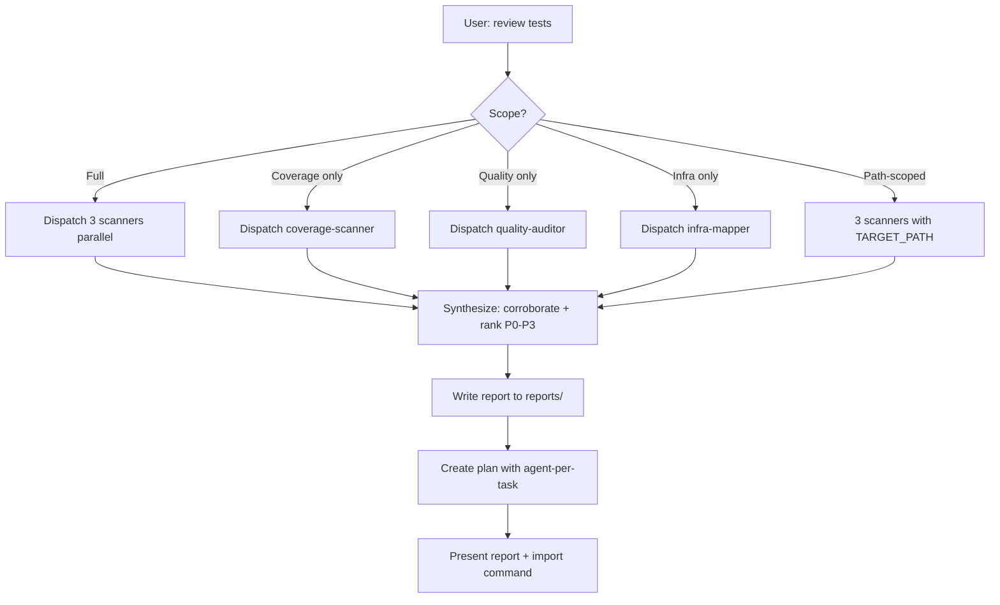

# Test Review

**Lead documentation:** See [docs/leads/test-review.md](docs/leads/test-review.md).

Orchestrates a comprehensive review of the project's testing approach by dispatching three fast subagents in parallel, synthesising their findings, writing a report, and **creating a Cursor-format plan** that can be imported into taskgraph. Each task in the plan records which sub-agent should execute it so the execution loop can run `tg start <taskId> --agent <agent>` and dispatch efficiently.

## Architecture

- **You (orchestrator)**: High-reasoning model. Coordinates dispatch, synthesises results, produces the report and the plan.
- **Subagents** (fast): Do the scanning grunt-work. Defined in `.cursor/agents/`:
  - `test-coverage-scanner` — finds untested code and coverage gaps
  - `test-quality-auditor` — evaluates test quality patterns
  - `test-infra-mapper` — maps test infrastructure and structural issues
- **Implementer** (fast): Used for remediation tasks (add tests, fix config, refactor). See `.cursor/agents/implementer.md`.

## Permissions

- **Lead**: read-write (writes report to reports/ and plan to plans/)
- **Propagation**: Phase 1 scanners MUST use readonly=true. Implementer tasks (from plan) are read-write.
- **Sub-agents**:

  | Agent | Permission | Phase |
  |-------|------------|-------|
  | test-coverage-scanner | read-only | 1 (scanning) |
  | test-quality-auditor | read-only | 1 (scanning) |
  | test-infra-mapper | read-only | 1 (scanning) |
  | implementer | read-write | Plan execution (after import) |

## Decision tree



## Workflow

### Phase 1: Dispatch (parallel)

Launch all three scanner subagents simultaneously via the Task tool with `model="fast"`. Each returns a structured report.

```
Task(description="scan test coverage gaps",
     prompt=<built from test-coverage-scanner.md>,
     model="fast", readonly=true)

Task(description="audit test quality",
     prompt=<built from test-quality-auditor.md>,
     model="fast", readonly=true)

Task(description="map test infrastructure",
     prompt=<built from test-infra-mapper.md>,
     model="fast", readonly=true)
```

### Phase 2: Synthesise

Once all three return, merge their reports. Look for:

1. **Corroborating signals** — e.g. infra-mapper says "no Jest config in package X" AND coverage-scanner says "package X has 0 test files". Merge into one finding.
2. **Conflicts** — e.g. quality-auditor flags a test as "too thin" but coverage-scanner counts it as covering the module. Prefer the quality-auditor's judgement; note it.
3. **Priority ranking** — rank findings by impact using this order:
   - P0: Untested critical paths (event sourcing reducers, auth, payments)
   - P1: Flawed tests (false positives, missing assertions, no error-path coverage)
   - P2: Infrastructure gaps (missing CI config, inconsistent runners, no coverage thresholds)
   - P3: Quality improvements (better factories, shared fixtures, naming conventions)

### Phase 3: Report

Write the full report to the top-level **reports** folder. Create the folder if it does not exist. Use a dated filename so runs are preserved:

- **Path**: `reports/test-review-YYYY-MM-DD.md` (use current date; if a file already exists for today, append a short suffix, e.g. `test-review-2026-02-27-2.md`).

Report structure to write:

```markdown
## Test Review Summary

### Health Score: X/10

### P0 — Critical Gaps

- ...

### P1 — Flawed Tests

- ...

### P2 — Infrastructure Gaps

- ...

### P3 — Quality Improvements

- ...

### Recommended Next Steps

1. ...
2. ...
3. ...
```

### Phase 4: Create a taskgraph plan

Create a **Cursor-format plan** that turns the recommended next steps into executable tasks. This allows the user to run `pnpm tg import plans/<file> --plan "<Plan Name>" --format cursor` and then execute tasks via the normal taskgraph loop (e.g. `pnpm tg next`, dispatch sub-agents, `tg start --agent <agent>`, etc.).

- **Path**: `plans/yy-mm-dd_test_review_<scope>.md` (e.g. `plans/26-02-27_test_review_full.md`). Use the date convention from `.cursor/rules/plan-authoring.mdc`.
- **Plan frontmatter**: Include `name`, `overview`, `fileTree` (files the plan may touch), `risks`, `tests`, and `todos`.
- **Each todo (task)** must include:
  - `id`: stable kebab-case key.
  - `content`: short task title (under 255 chars).
  - `intent`: what to do and why; references to packages/files from the findings.
  - `agent`: **which sub-agent should execute this task.** One of:
    - `test-coverage-scanner` — read-only re-scan or coverage verification task.
    - `test-quality-auditor` — read-only re-audit or quality verification task.
    - `test-infra-mapper` — read-only re-map or infra verification task.
    - `implementer` — any task that writes code (add tests, fix config, add fixtures, refactor tests).
  - `blockedBy`: only if the task truly depends on another (e.g. "add coverage threshold" blocked by "add Jest config").
  - `changeType`: e.g. `test`, `modify`, `fix`, `document`.
- **Parallel-ready**: Have at least two tasks with no `blockedBy` so the orchestrator can run tasks in parallel where possible.

If the review produced no actionable tasks, write a minimal plan with a single optional task (e.g. "Re-run test review after manual fixes") or state in the overview that no tasks were generated and the report is for information only.

**Example plan snippet** (one task per finding; agent recorded per task):

```yaml
todos:
  - id: add-reducer-tests-contracts
    content: Add unit tests for event reducers in packages/contracts
    intent: |
      Coverage scan found untested reducers in packages/contracts. Add __tests__ for
      deck and card reducers: happy path and at least one error path per event type.
      See reference.md for "What counts as covered" and P0 criteria.
    agent: implementer
    changeType: test
  - id: add-jest-config-db
    content: Add Jest config and test script to packages/db
    intent: |
      Infra mapper reported packages/db has no test script. Add jest.config.js
      and "test" script; align with root Jest version.
    agent: implementer
    changeType: modify
  - id: verify-coverage-after-fixes
    content: Re-run coverage scan to verify packages/contracts and packages/db
    intent: |
      After add-reducer-tests-contracts and add-jest-config-db are done, run
      test-coverage-scanner scoped to packages/contracts and packages/db.
    agent: test-coverage-scanner
    blockedBy: [add-reducer-tests-contracts, add-jest-config-db]
    changeType: investigate
```

After writing the plan:

1. Tell the user the report path and the plan path.
2. Give the exact import command: `pnpm tg import plans/yy-mm-dd_test_review_<scope>.md --plan "<Plan Name>" --format cursor`.
3. Remind them that each task records its `agent` in the plan; when executing, use `pnpm tg start <taskId> --agent <agent>` so taskgraph shows the right sub-agent per task.

**Summary to user**: Report saved to `reports/test-review-YYYY-MM-DD.md`; plan saved to `plans/yy-mm-dd_test_review_<scope>.md`. To run the tasks: import the plan with the command above, then use the normal taskgraph execution loop (see `.cursor/rules/taskgraph-workflow.mdc`). Optionally paste health score and top 2–3 findings in chat.

## Project-Specific Context

Pass this context to each subagent so they don't waste tokens rediscovering it:

```
PROJECT CONTEXT:
- Monorepo: apps/ (next, mobile, api, workers) + packages/ (contracts, db, machines-common, sync-machine, projection-*, sdk-turso, ai-chunks, components, config, modules, utils, shared)
- Test runners: Jest (most packages), Vitest (apps/api), Playwright (apps/next e2e)
- Root test command: `pnpm test` (turbo run test, excludes apps/next)
- Architecture: Event-sourcing (Commands → Events → Projections), XState machines, local-first sync
- Key patterns: neverthrow Result types, Zod validation at boundaries
- Packages with NO tests: components, config, modules, utils, shared
- Test file conventions: __tests__/*.test.ts (unit), __tests__/integration/*.integration.test.ts (integration), e2e/*.spec.ts (e2e)
```

## Scope Control

By default, review everything. The user can narrow scope:

| User says                     | Scope                               |
| ----------------------------- | ----------------------------------- |
| "review tests"                | Full review (all 3 subagents)       |
| "review test coverage"        | Coverage scanner only               |
| "review test quality"         | Quality auditor only                |
| "review test infra"           | Infra mapper only                   |
| "review tests in packages/db" | All 3 subagents scoped to that path |

When scoped to a path, pass `TARGET_PATH=<path>` to the subagents.

## Reference

For detailed evaluation criteria used by each subagent, see [reference.md](reference.md).
