# Review (read-only)

**Lead documentation:** See [docs/leads/review.md](../../docs/leads/review.md). **Shared learnings for sub-agents:** [.cursor/agent-utility-belt.md](../../agent-utility-belt.md).

This skill is **read-only**: no file edits, no database writes, no destructive commands. The orchestrator coordinates sub-agents that gather and assess; you synthesize their findings into a single report.

## When to use

- User says "review", "code health", "system health", "health check", or "how healthy is the codebase".
- User asks to evaluate a **new feature** or **proposal** — then also run risk assessment (see below).

## Scope

| User intent                     | Code health | System health | Risk assessment | Assessment specialists      |
| ------------------------------- | ----------- | ------------- | --------------- | --------------------------- |
| General review / health check   | Yes         | Yes           | No              | Optional (see below)         |
| Review + new feature / proposal | Yes         | Yes           | Yes             | Optional (see below)         |
| Review + security / fairness / rubric | Yes   | Yes           | As above        | Yes — match specialist to ask |

**New feature potential** = user mentions a new feature, proposal, or "what if we add X"; or explicitly asks for risk assessment. When in doubt, include risk.

**Assessment specialists** = include when user asks for "security review", "risk scorecard", "factuality check", "fairness audit", "rubric evaluation"; or when the review target is security-sensitive (CLI, MCP, db) or high-impact (schema, worktree). See Architecture table for which specialist to dispatch.

## Architecture

- **You (orchestrator / review lead)**: Gathers baseline, dispatches sub-agents, synthesizes report.
- **Core sub-agents**:

  | Agent                          | Purpose                                          | Permission |
  | ------------------------------ | ------------------------------------------------ | ---------- |
  | investigator                   | Code health analysis                             | read-only  |
  | investigator                   | System health analysis                           | read-only  |
  | generalPurpose (or risk skill) | Risk assessment (when feature/proposal in scope) | read-only  |

- **Assessment specialists** (dispatch when scope or user intent matches; all read-only):

  | Specialist                       | Main question                               | Dispatch when |
  | -------------------------------- | ------------------------------------------- | ------------- |
  | **adversarial-security-reviewer** | Is this safe and hard to abuse?             | Security-sensitive areas (CLI, MCP, plan-import, db); or user asks for security review |
  | **risk-preparedness-reviewer**   | What could go wrong if we ship this?         | High-impact work (schema, CLI contract, worktree); release gate; or user asks for scorecard |
  | **factuality-traceability-reviewer** | Do claims in code/docs match reality?  | Doc-heavy or domain-touching tasks; any change touching `docs/` or critical comments |
  | **fairness-equity-auditor**      | Is the task graph and process balanced?     | User asks to audit fairness; periodic process audit; input = `tg status --tasks` / `--projects` |
  | **rubric-driven-reviewer**       | How does this score on each dimension?       | Benchmarking, plan comparison, or user asks for rubric evaluation |

## Permissions

- **Lead**: read-only
- **Propagation**: All sub-agents MUST use readonly=true.
- **Rule**: No file edits, no `tg start`/`tg done`, no DB writes, no destructive commands.

## Decision tree

```mermaid
flowchart TD
    A[User: review / health check] --> B{New feature or proposal?}
    B -->|No| C[Scope: code + system health]
    B -->|Yes| D[Scope: code + system + risk]
    C --> E[Dispatch investigator: code health]
    C --> F[Dispatch investigator: system health]
    D --> E
    D --> F
    D --> G[Run risk or dispatch generalPurpose]
    E --> H{Assessment specialist requested?}
    F --> H
    G --> H
    H -->|Security| I1[adversarial-security-reviewer]
    H -->|Scorecard| I2[risk-preparedness-reviewer]
    H -->|Factuality/docs| I3[factuality-traceability-reviewer]
    H -->|Fairness| I4[fairness-equity-auditor]
    H -->|Rubric| I5[rubric-driven-reviewer]
    H -->|No| J[Synthesize report]
    I1 --> J
    I2 --> J
    I3 --> J
    I4 --> J
    I5 --> J
    J --> K[Deliver: chat + optional reports/]
```



## Workflow

### 1. Gather baseline (orchestrator)

Run read-only commands so sub-agents have context:

- `pnpm tg status --tasks` — task graph state (doing, todo, blocked, stale).
- Optionally `pnpm tg status` (full output) for vanity metrics and active work.
- If risk is in scope: `pnpm tg crossplan summary --json` if available; else list active plans and read `plans/*.md` for fileTree/risks.

Capture output and pass into sub-agent prompts where useful.

### 2. Dispatch sub-agents (parallel, read-only)

Use **mcp_task** (or Task tool) with **readonly=true**. Emit all calls in the **same turn** so they run in parallel (see `.cursor/agent-utility-belt.md` § Parallel sub-agent dispatch; reviewers are read-only so no shared mutable state).

**Code health** — dispatch **investigator** (or generalPurpose with investigator-style directive):

- **Directive**: "Assess code health for this repo. Cover: (1) structure and layering (cli/domain/db, boundaries), (2) patterns and consistency (naming, error handling, types), (3) tech debt and hotspots, (4) test coverage and test quality signals, (5) main risks and gaps. Do not edit any file. Return structured findings: Files and roles, Architectural patterns, Risks and gaps, Suggested follow-up tasks."
- **Scope**: whole repo or user-specified path (e.g. `TARGET_PATH=src/cli`).
- **subagent_type**: investigator (preferred) or generalPurpose.

**System health** — dispatch **investigator** (or generalPurpose):

- **Directive**: "Assess system health for this task-graph repo. Use the following tg status output as input. Cover: (1) task graph state — stale doing tasks, orphaned or blocked tasks, plan completion; (2) gate/lint/typecheck — any known failure modes or flakiness; (3) dependency and tooling state; (4) operational readiness and suggested cleanup. Do not edit any file or run destructive commands. Return structured findings: summary, issues, suggested follow-up."
- **Context**: Paste `tg status --tasks` (and if available a one-line summary of gate: e.g. 'gate passes' or 'gate: typecheck failed on X').
- **subagent_type**: investigator or generalPurpose.

**Risk assessment (only when scope is new feature / proposal)** — run the **risk** workflow:

- Either:
  - **Option A**: Apply the risk skill yourself (read `.cursor/skills/risk/SKILL.md` and `.cursor/skills/risk/CODE_RISK_ASSESSMENT.md`; gather scope, rate metrics, produce the risk report), or
  - **Option B**: Dispatch a **generalPurpose** sub-agent with readonly=true and a prompt that includes the risk skill content plus the current scope (plans, fileTree, crossplan summary if available). Ask it to produce the Risk Assessment Report per the template in CODE_RISK_ASSESSMENT.md.
- Use the same output template (Summary table, Cross-Plan Interactions, Mitigation Strategies, Recommended Execution Order) as in risk.

### 3. Optionally dispatch assessment specialists

When user intent or scope matches (security-sensitive area, high-impact change, "security review", "fairness audit", "rubric evaluation", etc.), dispatch the relevant specialist with **readonly=true** in the same parallel batch or after core agents. Use the agent templates in `.cursor/agents/` and lead docs in `docs/leads/`:

- **adversarial-security-reviewer** — Pass diff/change set; request VERDICT: PASS / CONCERNS / FAIL with risks and severity.
- **risk-preparedness-reviewer** — Pass change or plan; request scorecard (Critical/High/Medium/Low) + top mitigations.
- **factuality-traceability-reviewer** — Pass diff + docs; request PASS/FAIL with specific inconsistencies.
- **fairness-equity-auditor** — Pass `tg status --tasks` and `--projects` (and optionally initiative rollup); request structured report (skews, rebalances).
- **rubric-driven-reviewer** — Pass change or plan + rubric dimensions; request per-dimension scores and overall pass/fail.

### 4. Synthesize report (orchestrator)

Merge sub-agent outputs into one report. Suggested structure:

```markdown
## Review Report — [date or scope]

### Code health

[Findings from code-health sub-agent: structure, patterns, tech debt, tests, risks.]

### System health

[Findings from system-health sub-agent: task graph, gate, dependencies, cleanup.]

### Risk assessment (if in scope)

[Summary table and narrative from risk; link to full risk report if produced separately.]

### Assessment specialists (if dispatched)

[Security / scorecard / factuality / fairness / rubric findings per specialist used.]

### Summary and next steps

- Overall health: ...
- Top 3–5 actionable items
- Optional: suggested follow-up tasks or plan ideas
```

Resolve conflicts (e.g. one agent says "tests adequate", another "gaps in X") by noting both and stating which you treat as authoritative and why.

### 5. Deliver

- Post the report in chat.
- Optionally write to `reports/review-YYYY-MM-DD.md` (create `reports/` if needed). If risk was in scope, you can write the full risk section to `reports/risk-assessment-YYYY-MM-DD.md` or keep it inside the main review file.

## Sub-agent constraints (remind in prompts)

- **Read-only**: No file edits, no `tg start`/`tg done`, no DB writes, no destructive or state-changing commands.
- **Structured output**: Request the sections above so synthesis is easy.
- **No code generation**: Sub-agents describe what they see and recommend; they do not write patches or config.

## Reference

- **Lead doc**: [docs/leads/review.md](../../docs/leads/review.md)
- **Risk**: `.cursor/skills/risk/SKILL.md`, `.cursor/skills/risk/CODE_RISK_ASSESSMENT.md`
- **Investigator**: `.cursor/agents/investigator.md`
- **Assessment specialists**: `.cursor/agents/adversarial-security-reviewer.md`, `risk-preparedness-reviewer.md`, `factuality-traceability-reviewer.md`, `fairness-equity-auditor.md`, `rubric-driven-reviewer.md`; lead docs in `docs/leads/`
- **Proposal**: [reports/26-03-02_assessment_specialists_proposal.md](../../reports/26-03-02_assessment_specialists_proposal.md)
- **Dispatch**: `.cursor/rules/subagent-dispatch.mdc` (use readonly and parallel batch in one turn)
