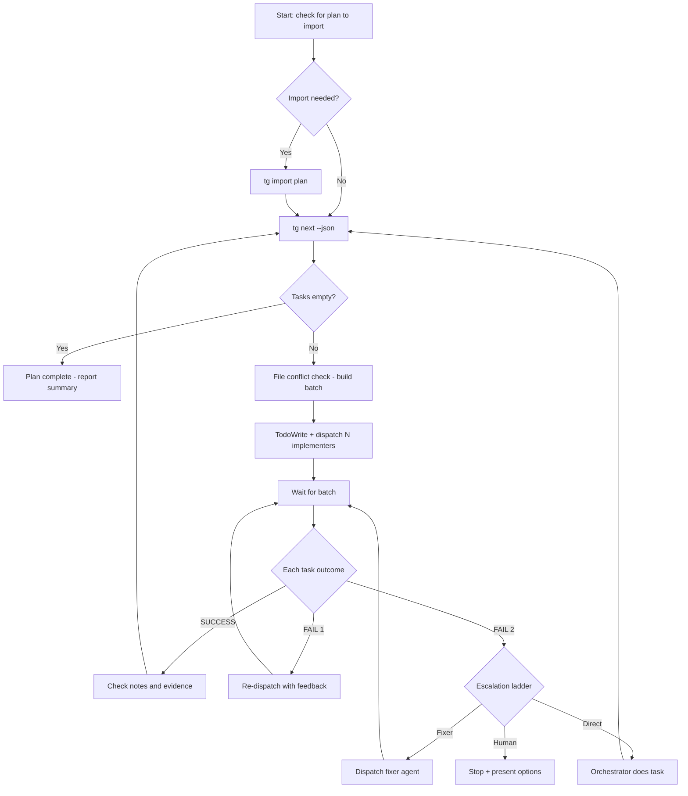

# Work — Autonomous Task Execution

**Lead documentation:** See [docs/leads/execution.md](docs/leads/execution.md).

When this skill is invoked, enter an autonomous execution loop. Do not stop to ask the human unless a sub-agent fails twice or you hit an ambiguity you cannot resolve.

## Architecture

- **You (orchestrator / execution lead)**: Coordinates the execution loop. Dispatches implementers, reviews results, escalates failures.
- **Sub-agents**:

  | Agent | Purpose | Permission |
  |-------|---------|------------|
  | implementer | Execute task (code, tests, docs) | read-write |
  | reviewer (or spec-reviewer + quality-reviewer) | Evaluate implementation | read-only |
  | fixer | Escalation after 2 implementer failures | read-write |

## Permissions

- **Lead**: read-write (orchestrates task execution, writes to task graph)
- **Propagation**: Mixed. Implementer and fixer are read-write. Reviewers are read-only.
- **Sub-agents**:

  | Agent | Permission |
  |-------|------------|
  | implementer | read-write |
  | reviewer / spec-reviewer / quality-reviewer | read-only |
  | fixer | read-write |

## Decision tree



## Task orchestration UI — ALWAYS use when running tg tasks

When executing tasks from tg, **always structure work so Cursor surfaces the "Task orchestration for autonomous execution" panel.** This gives the human a single place to see which sub-agents are doing what (meta todo + sub-agent management). Assume there will always be one or more tasks; use the same orchestration flow whether it's 1 or 5.

**Before each batch:**

1. Get runnable tasks: `tg next [--plan <planId>] --json --limit 20` (feed all; Cursor decides concurrency)
2. **Call TodoWrite with the task list** (see subagent-dispatch.mdc TodoWrite protocol) — pass the tasks from step 1 before dispatching any sub-agents. TodoWrite is the progress report for the orchestration panel; it surfaces the batch in Cursor's "Task orchestration for autonomous execution" UI.
3. Keep `.cursor/agents/implementer.md` in context when starting the loop — the orchestration panel is often tied to that agent context.
4. Dispatch sub-agents via the Task tool or mcp_task; **emit all Task/mcp_task calls for the current batch in the same turn** so the batch runs as intended. Cursor will populate the orchestration panel with task status as work progresses.

## Before the loop — plan import (context)

**Context matters.** If the conversation implies a plan that should be executed (e.g. a plan was just created or the user said "proceed" / "execute" after a plan was presented, or the user attached or referenced a plan file), ensure that plan is in the task graph before starting the loop:

1. **Identify the plan** — From the same thread: a plan file path (e.g. `plans/26-02-27_blocked_status_materialized.md`), the plan name (e.g. from the plan’s `name` frontmatter), or a plan that was just approved for execution.
2. **Import if needed** — Run:
   ```bash
   pnpm tg import plans/<filename> --plan "<Plan Name>" --format cursor
   ```
   Use the plan’s filename and the exact `name` from its frontmatter. If the plan is already imported, the command will still succeed (upsert behavior).
3. **Scope the run (optional)** — If you imported or identified a single plan to run, use it for the loop: `tg next --plan "<Plan Name>" --json --limit 20` so work focuses on that plan’s tasks first. Otherwise proceed in multi-plan mode (see below).

If no plan is indicated by context or the user, skip import and use multi-plan mode.

## Loop

```
while true:
  1. tasks = tg next [--plan <planId|planName>] --json --limit 20
  2. if tasks is empty → plan complete, report summary, stop
  3. batch = all non-conflicting tasks from tasks (no file overlap); do not cap size — Cursor decides concurrency
  4. TodoWrite with the task list (from step 1) before dispatching — this is the orchestration panel progress report.
  5. Emit all Task/mcp_task calls for this batch in the same turn (batch-in-one-turn).
  6. for each task in batch:
       a. context = tg context <taskId> --json
       b. build implementer prompt from .cursor/agents/implementer.md + context
       c. dispatch sub-agent (Task tool or mcp_task, model=fast)
  7. wait for all sub-agents to complete
  8. for each completed sub-agent:
       a. TodoWrite merge=true to update progress (e.g. mark that task complete in the todo list).
       b. if SUCCESS → check return message and task notes (including after the final task in a plan, e.g. full-suite run); if implementer reported environment/gate issues or follow-up, run **Follow-up from notes/evidence** (subagent-dispatch.mdc): orchestrator decides whether to create task(s) with `tg task new ... --plan <planId>` and delegate.
       c. if FAIL → re-dispatch once with feedback
       d. if FAIL again → apply **escalation ladder** (see subagent-dispatch.mdc “Escalation decision tree”): consider **fixer agent** (stronger model), **direct execution** (orchestrator does the task), or **escalate to human**; see Escalation below.
  9. loop back to step 1
```

## Sub-Agent Timeout

Each sub-agent gets a **budget of 90 seconds** of wall time. If a sub-agent has not returned after 90s:

1. Check the sub-agent's output file for progress.
2. If making progress (new output in last 120s) → extend by another 120s, max 2 extension.
3. If stalled → kill the sub-agent, mark the task as needing attention, and continue with the next task.

After the loop completes (or on timeout), the orchestrator reviews what happened and decides whether to retry, skip, or escalate.

## File Conflict Check

Before dispatching tasks in parallel, check if any tasks in the batch touch the same files (compare `file_tree`, `suggested_changes`, or intent references). If overlap exists, run those tasks sequentially, not in parallel.

## Escalation — Escalation ladder and when to stop for the human

When a sub-agent has **failed twice** on the same task, use the **escalation decision tree** in `.cursor/rules/subagent-dispatch.mdc`: choose among (1) **fixer agent** — dispatch the fixer sub-agent (stronger model; see `.cursor/agents/fixer.md`) with task context and failure feedback; (2) **direct execution** — orchestrator does the task and logs with `tg note <taskId> --msg "Direct execution: 2 sub-agent failures"`; (3) **escalate to human** — stop the loop and present summary + options (below). Do not default only to direct execution; prefer the fixer when the failure is implementation/review and the task is well-scoped.

Stop the loop and present a summary + options when:

- After applying the ladder, you chose **escalate to human** (e.g. credentials, ambiguous intent, safety, or repeated direct-execution failure).
- A task's intent is **ambiguous** — you cannot determine what to do without a design decision.
- A task requires **credentials, secrets, or external access** you don't have.
- More than **5 tasks** have failed in a single loop run (systemic issue).

When escalating to the human, provide:

1. **Summary**: What was completed, what failed, what remains.
2. **Diagnosis**: Why the failure happened (error message, diff, context).
3. **Options**: Concrete choices (e.g. "I can retry with X approach", "Skip this task and continue", "This needs your input on Y").

## Progress Reporting

After each batch completes, emit a brief status line:

```
[work] Batch N: completed 5/5 tasks. Remaining: 7 tasks across 2 plans.
```

At the end of the loop (plan complete or all tasks done), emit a full summary:

```
[work] Plan "<name>" complete.
  Done: 10 tasks
  Failed: 1 task (escalated)
  Skipped: 0
  Duration: ~4 min
```

## Multi-Plan Mode

If no plan was imported or scoped in **Before the loop**, work across all active plans. Use `tg next --json --limit 20` (no plan filter) and process all non-conflicting tasks; Cursor decides concurrency.

## Per-batch gate vs full test suite

- **Per-batch gate (optional/lightweight):** If `scripts/cheap-gate.sh` exists, you may run it after each batch to catch regressions early (`bash scripts/cheap-gate.sh`). This is optional or lightweight; the orchestrator does not run the full test suite after every batch.
- **Full test suite:** The full test suite is run only as the **dedicated final plan task** (the run-full-suite task), not by the orchestrator after every batch.
- **When the final run-full-suite task fails:** Follow **Follow-up from notes/evidence** in `.cursor/rules/subagent-dispatch.mdc`: the implementer marks the task done with evidence (e.g. `gate:full failed: <reason>`) and adds a `tg note`; the orchestrator evaluates and creates fix tasks or escalates (lead-informed protocol).
