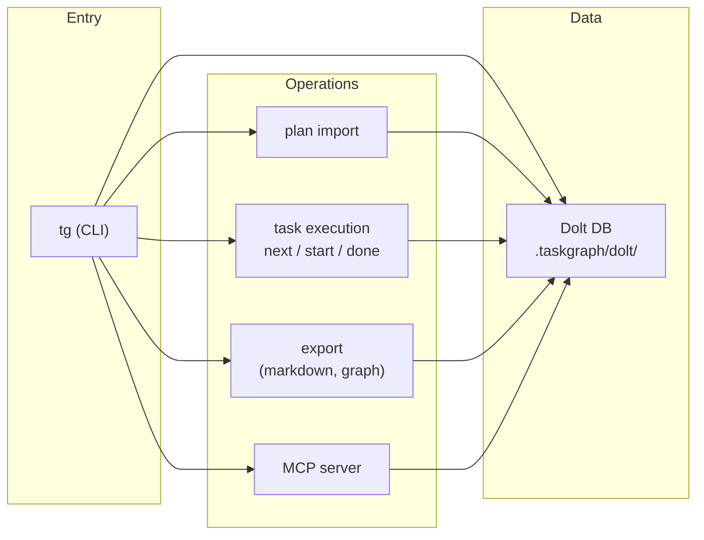

# TaskGraph

**Dolt-backed CLI for centaur development.**

[](https://www.npmjs.com/package/@danalexilewis/taskgraph)
[](https://opensource.org/licenses/MIT)
[](https://nodejs.org)
[](https://github.com/danalexilewis/Task-Graph)

TaskGraph is inspired by ideas from Beads and Gastown but stays minimal and local-first. It gives you and your AI agents a shared task graph: plans, tasks, dependencies, and execution state—all stored in Dolt and driven from the CLI. It's built for Cursor workflows where humans and agents collaborate on the same graph without heavy orchestration.

## What This Is

- **CLI + Dolt** for plans, tasks, dependencies, and execution state—versioned and queryable.
- **Multi-agent friendly**: 2–3 agents plus a human can work the same graph with clear ownership and coordination.
- **Rich plan format**: structured plans (YAML frontmatter, todos) that import cleanly and drive task execution.
- **MCP server**: `tg-mcp` exposes task graph operations to Cursor and other MCP clients.
- **Sub-agent architecture**: skills, leads, and workers so the orchestrator can dispatch specialized agents (implementer, reviewer, investigator, etc.) per task.

## What This Isn't

- **Not Gastown-style orchestration**—no full pipeline or convoy control; TaskGraph is a shared task store and CLI, not an execution conductor.
- **No convoys or swarms**—you run agents (e.g. in Cursor); TaskGraph tracks what to do and who's doing it.
- **Not a project management tool**—it's a **development execution tool**: same repo, same tasks, human and agents moving work to done.

## Table of contents

- [Installation](#installation)
- [Quick Start](#quick-start)
- [Architecture](#architecture)
- [Agent system](#agent-system)
- [CLI features](#cli-features)
- [MCP server](#mcp-server)
- [Multi-agent support](#multi-agent-support)
- [Development](#development)
- [FAQ](#faq)
- [Contributing](#contributing)
- [Acknowledgments](#acknowledgments)
- [License](#license)

## Installation

**Prerequisites**

- **Node.js** ≥ 18
- **Dolt** — install via Homebrew: `brew install dolt`
- **Bun** (optional) — for running the CLI with Bun

Install the Task Graph CLI as a dev dependency:

```bash
pnpm add -D @danalexilewis/taskgraph
```

Run commands with `pnpm tg` or `npx tg`:

```bash
pnpm tg init
pnpm tg setup   # optional: scaffold docs and Cursor rules
```

## Quick Start

End-to-end workflow with concrete commands:

```bash
# 1. Install
pnpm add -D @danalexilewis/taskgraph

# 2. Initialize the task graph in this repo
pnpm tg init

# 3. (Optional) Scaffold docs and Cursor conventions
pnpm tg setup

# 4. Create a plan file (e.g. plans/my-plan.md in Cursor format)
# Then import it:
pnpm tg import plans/my-plan.md --plan "My Plan" --format cursor

# 5. See runnable tasks
pnpm tg next --plan "My Plan"

# 6. Start a task (replace <taskId> with a task from next)
pnpm tg start <taskId> --agent my-agent

# 7. After doing the work, mark it done
pnpm tg done <taskId> --evidence "Implemented X; ran pnpm gate"

# 8. Check status
pnpm tg status --tasks
```

For full command and option details, see [docs/cli-reference.md](docs/cli-reference.md).

## Architecture

High-level flow and repository layout. Full detail: [docs/architecture.md](docs/architecture.md).

### Flow



### Layers

| Layer            | Role                                                                                         |
| ---------------- | -------------------------------------------------------------------------------------------- |
| **cli/**         | Commander.js commands and CLI utilities; orchestrates calls to domain, db, and other layers. |
| **db/**          | Dolt connection, commit, and migration; `doltSql` / `doltCommit` via `execa`.                |
| **domain/**      | Core business logic: types, Zod schemas, invariants, error definitions.                      |
| **plan-import/** | Markdown plan parsing and database import (Cursor plan format).                              |
| **export/**      | Graph and markdown export (Mermaid, DOT, markdown).                                          |

### Repository layout

```
src/
  cli/           # CLI entry and commands
  db/            # Dolt connection, commit, migration
  domain/        # Types, schemas, invariants
  export/        # Markdown and graph export
  plan-import/   # Plan parsing and import
.taskgraph/      # Config and Dolt repo (e.g. .taskgraph/dolt/)
plans/           # Cursor plan markdown files
docs/            # Architecture, CLI reference, plan format
.cursor/         # Agents, rules, skills, hooks
```

For configuration, branching, multi-machine sync, and error handling, see [docs/architecture.md](docs/architecture.md).

## Agent system

Sub-agent architecture: the **orchestrator** (main Cursor agent in a chat) interprets user intent, invokes **skills** when triggered, and coordinates **leads** and **workers**. **Leads** are orchestration patterns created by skills: they dispatch workers, collect results, and synthesize. **Workers** are task-level executors (implementer, reviewer, etc.) that do bounded work; they do not orchestrate other agents.

- **Orchestrator** — Chooses skills (e.g. `/plan`, `/work`, `/investigate`), dispatches leads and workers, coordinates only; does not perform implementation except as fallback after a worker has failed twice on the same task.
- **Leads** — Created when a skill runs. A lead receives a directive, dispatches workers, and synthesizes outcomes. Defined by skills and documented in [docs/leads/](docs/leads/).
- **Workers** — Execute single tasks or reviews; prompts live in `.cursor/agents/`.

See [docs/agent-strategy.md](docs/agent-strategy.md) for the full decision tree and [docs/leads/README.md](docs/leads/README.md) for the lead registry.

### Skills

| Skill        | Trigger                                                                                           | Description                                                                                                                                                  |
| ------------ | ------------------------------------------------------------------------------------------------- | ------------------------------------------------------------------------------------------------------------------------------------------------------------ |
| plan         | "plan", "make a plan", "/plan", or describes a feature to plan                                    | Create a rich project plan with codebase analysis, file trees, risks, tests, and structured tasks.                                                           |
| work         | "work", "go", "execute", "grind", or wants tasks completed autonomously                           | Autonomous task execution loop; grinds through plan tasks via sub-agent dispatch.                                                                            |
| investigate  | /investigate or wants to investigate next steps from recent tasks/failures                        | Quick investigation from chat and docs; creates plan and tasks; dispatches investigator sub-agent.                                                           |
| review       | "review", "health check", "code health", "system health", or evaluate a feature idea              | Read-only code and system health review using sub-agents; includes optional risk assessment.                                                                 |
| debug        | /debug or unclear root cause (e.g. failing test with unknown cause)                               | Systematic debugging: 4-phase process (investigate, pattern, hypothesis, implement); escalate after 3 failed fix attempts.                                   |
| risk         | Evaluating a feature proposal, implementation plans, or asks about risk/impact/safety             | Assess risk profile of code changes or proposed features using the project's 8-metric risk model.                                                            |
| meta         | Multiple plans; wants to surface file conflicts, domain clusters, or execution ordering           | Enrich the task graph with cross-plan and cross-project edges and notes (writes only after user approval).                                                   |
| rescope      | "rescope", clarifies requirements, or how the system should behave after tasks are done           | Clarify desired functionality when shipped behavior does not match intent; PM role; may dispatch explorer, spec-reviewer, quality-reviewer, planner-analyst. |
| report       | "report", "write it up", "capture this", or findings to persist to reports/                       | Write a structured report from the conversation context (research, investigation, review, benchmarks).                                                       |
| review-tests | "review tests", "audit test coverage", "improve testing strategy", "assess test health"           | Audit testing approach, coverage, quality, and infrastructure; dispatches test scanners; orchestrator synthesizes and produces a plan.                       |
| create-hook  | "create a hook", "add a hook", "lifecycle hook", or automate on agent stop / afterFileEdit / etc. | Create or add Cursor agent lifecycle hooks in `.cursor/hooks/`; registered in `.cursor/hooks.json`.                                                          |

<details>
<summary>Lead registry (from docs/leads/README.md)</summary>

| Lead            | Skill        | Agent file(s)                                                          | Purpose                                                                                   |
| --------------- | ------------ | ---------------------------------------------------------------------- | ----------------------------------------------------------------------------------------- |
| investigator    | /investigate | investigator.md                                                        | Read-only investigation; dispatches investigator sub-agent with tactical directives.      |
| planner-analyst | /plan        | planner-analyst.md                                                     | Pre-plan analysis; gathers codebase context before plan creation.                         |
| execution       | /work        | implementer.md, reviewer.md                                            | Task execution loop; implementer does work, reviewer evaluates; orchestrator coordinates. |
| test-review     | /test-review | test-quality-auditor, test-infra-mapper, test-coverage-scanner         | Audits tests; dispatches scanner sub-agents; orchestrator synthesizes findings and plan.  |
| review          | /review      | investigator.md                                                        | Read-only code health, system health, and optional risk assessment.                       |
| rescope         | /rescope     | explorer.md, spec-reviewer.md, quality-reviewer.md, planner-analyst.md | PM-role lead that clarifies desired functionality vs shipped behavior.                    |
| risk            | /risk        | (none; orchestrator direct)                                            | Read-only risk assessment using 8-metric model across plans.                              |
| meta            | /meta        | (none; orchestrator direct)                                            | Cross-plan and cross-project edge enrichment; writes only after user approval.            |
| debug           | /debug       | investigator.md, implementer.md (optional)                             | Systematic debugging: 4-phase process; escalate after 3 failed fix attempts.              |

</details>

<details>
<summary>Workers (agent files in .cursor/agents/)</summary>

- **implementer** — Execute a single task (tg start → work → tg done).
- **reviewer** — Evaluate an implementation against the task spec.
- **documenter** — Documentation-only tasks (README, CHANGELOG, docs/).
- **explorer** — Codebase exploration and context gathering (quick / medium / thorough).
- **planner-analyst** — Pre-plan codebase analysis for the planning model.
- **investigator** — Read-only investigation; files, function chains, architecture, schemas.
- **spec-reviewer** — Spec compliance check (PASS/FAIL): intent, scope, suggested_changes.
- **quality-reviewer** — Code quality check (PASS/FAIL): patterns, tests, errors.
- **test-quality-auditor** — Audit test quality and suggest improvements.
- **test-infra-mapper** — Map and document test infrastructure.
- **test-coverage-scanner** — Scan test coverage and highlight gaps.
- **debugger** — Systematic debugging; hypothesis-driven investigation.
- **fixer** — Escalation; resolves tasks after implementer/reviewer failure (stronger model).

</details>

## CLI features

Commands are grouped by purpose:

| Group            | Commands                                                      |
| ---------------- | ------------------------------------------------------------- |
| **Setup**        | `init`, `setup`                                               |
| **Planning**     | `plan new` / `plan list`, `import`, `template apply`          |
| **Tasks**        | `task new`, `start`, `done`, `cancel`, `split`, `block`       |
| **Dependencies** | `edge add`                                                    |
| **Navigation**   | `next`, `show`, `context`, `status`                           |
| **Dashboard**    | `dashboard`, `status --tasks` / `status --projects`           |
| **Export**       | `export mermaid` / `export dot` / `export markdown`           |
| **Analytics**    | `stats`, `portfolio`, `crossplan`                             |
| **Gates**        | `gate create` / `gate resolve` / `gate list`                  |
| **Multi-agent**  | `start --agent` / `start --worktree`, `worktree list`, `note` |
| **MCP**          | `tg-mcp` (MCP server)                                         |

**Key features**

- **Worktrees** — isolate agent sessions per worktree; `worktree list` and `start --worktree`.
- **Dolt branching** — plans and tasks live in a Dolt repo; branch and sync with `tg branch`, `tg sync`.
- **Rich plan format** — YAML frontmatter, todos, and optional agent/skill metadata; see [docs/plan-format.md](docs/plan-format.md).
- **Cross-plan analysis** — `crossplan` and portfolio views across plans and initiatives.
- **External gates** — `gate create` / `resolve` / `list` for gating releases or deployments.
- **Template system** — `template apply` and scaffolded plans/tasks from templates.
- **Live dashboard** — `dashboard` and `status --tasks` / `--projects` for live task and project views.

Full command and option reference: [docs/cli-reference.md](docs/cli-reference.md).

## MCP server

TaskGraph provides an **MCP (Model Context Protocol) server** (`tg-mcp`) so AI assistants can read task and plan data without using the CLI.

- **Read-only tools**: `tg_status`, `tg_context`, `tg_next`, `tg_show` — same data as the equivalent `tg` commands.
- **Clients**: Works with Cursor, Claude Desktop, and other MCP-compatible clients.
- **Setup**: Run from the project root (directory containing `.taskgraph/`); the server reads `.taskgraph/config.json`.

For setup, tool parameters, and Cursor/Claude configuration, see [docs/mcp.md](docs/mcp.md).

## Multi-agent support

TaskGraph is designed for **2–3 agents** working alongside a human.

- **Publish + observe** — Agents broadcast intent (`tg start --agent`, `tg note`) and observe state (`tg status`). No negotiation; append-only coordination.
- **Agent identity** — Use the `--agent` flag on `start` and `note` so `tg status` shows who is doing what.
- **File isolation** — Use `tg start <taskId> --worktree` so each task gets an isolated git worktree and agents don't clash on the same files.
- **Notes** — Notes are the boundary between one-task (implementer) and cross-task (orchestrator) perspectives; use `tg note` when changing shared interfaces or discovering issues beyond the current task.
- **Metrics** — `tg stats` shows tasks completed, review pass/fail, and average elapsed time per agent.

For the full model and event conventions, see [docs/multi-agent.md](docs/multi-agent.md).

## Development

To work on TaskGraph itself:

- **Prerequisites**: Node ≥18, [Dolt](https://docs.dolthub.com/introduction/getting-started) (`brew install dolt`), [Bun](https://bun.sh) (test runner).
- **Setup**: `git clone` → `pnpm install` → `pnpm build`.
- **Tests**: `pnpm test` (unit), `pnpm test:integration` (integration), `pnpm gate` (lint → typecheck on changed files → affected tests), `pnpm gate:full` (full suite).
- **CLI from repo**: `pnpm tg` (uses `dist/` from the last build).

See [docs/testing.md](docs/testing.md) for test conventions.

## FAQ

**Do I need Dolt?**  
Yes. Dolt is the backing store for the task graph. Install with `brew install dolt`.

**Does this work without Cursor?**  
The CLI works standalone. Agent features (skills, sub-agents, rules) are Cursor-specific; the task graph and CLI are tool-agnostic.

**Can multiple agents work at once?**  
Yes. Use `--agent <name>` on `tg start` and `tg note`, and optionally `--worktree` for file isolation. See [docs/multi-agent.md](docs/multi-agent.md).

**How do I sync the task graph across machines?**  
The graph lives in `.taskgraph/dolt/`. Use Dolt remotes: from `.taskgraph/dolt/`, run `dolt remote add origin <url>` once, then `dolt pull` / `dolt push`. A `tg sync` command is planned.

**What's the difference between gates and blocks?**  
**Gates** block a task on an _external_ condition (human approval, CI, webhook). **Blocks** are task-on-task dependencies (`tg block` or `edge add ... blocks`).

**Can I use this with Claude Code or other AI tools?**  
The MCP server (`tg-mcp`) works with any MCP-compatible client. The CLI runs from any terminal.

## Contributing

Contributions that improve clarity, behavior, or docs are welcome. Before committing, run `pnpm gate` (lint, typecheck on changed files, affected tests). When you change user- or agent-facing behavior, update the relevant docs (see `.cursor/rules/docs-sync.mdc`).

## Acknowledgments

- [Beads](https://github.com/steveyegge/beads) — atomic claims, structured notes.
- [Gastown.dev](https://gastown.dev) — centaur development model.
- [oh-my-cursor](https://github.com/tmcfarlane/oh-my-cursor) — README structure inspiration.

## License

MIT. See [LICENSE](LICENSE).
