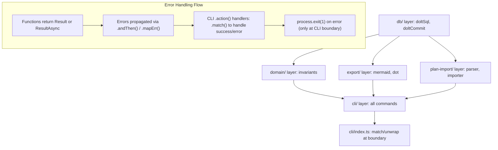

# Architecture

The Task Graph system is built around a Command Line Interface (CLI) that interacts with a Dolt database, acting as a Git-like version-controlled data store. This architecture is designed for reliability, determinism, and ease of audit.

## Data Store

-   **Dolt Repository**: The core data for plans, tasks, dependencies, events, and decisions is persisted in a Dolt repository. This repository is typically located within the project at `.taskgraph/dolt/` or an adjacent directory.
-   **Access Method**: Data access is primarily via the `dolt sql` CLI command. This approach, executed through `execa` in TypeScript, prioritizes robustness and avoids the need for a persistent MySQL server connection.
-   **Version Control**: All data modifications are treated as Dolt commits, providing a complete audit trail of changes with meaningful messages.

## Execution Surface (CLI)

The agent interacts with the Task Graph system through a small, safe CLI, `tg`. This CLI is built using `commander.js` and is the primary interface for creating, managing, and querying the task graph.

### Repository Layout

The project adheres to a structured repository layout to separate concerns and improve maintainability:

```
tools/taskgraph/
  src/
    cli/           # Commander.js commands and CLI utilities
    db/            # Dolt connection, commit, and migration logic
    domain/        # Core business logic: types, Zod schemas, invariants, error definitions
    export/        # Graph visualization logic (Mermaid, DOT)
    plan-import/   # Markdown plan parsing and database import logic
  package.json
  tsconfig.json
plans/               # Directory for Cursor Plan docs (narrative layer)
AGENT.md             # Agent contract and operating protocol
.taskgraph/
  config.json        # Local configuration for the Task Graph system
```

## Data Flow and Error Handling

The system employs a bottom-up data flow with `neverthrow` Result types for explicit error handling.



-   **`db/` layer**: Handles direct interaction with Dolt. Functions like `doltSql` and `doltCommit` return `ResultAsync` to encapsulate potential database operation failures.
-   **`domain/` layer**: Contains core business logic and invariants. Functions here return `Result` (for synchronous operations) or `ResultAsync` (for operations involving DB calls) to ensure all possible failure states are explicitly handled.
-   **`export/` and `plan-import/` layers**: These layers process data from the database or external files and transform it. They also return `Result` or `ResultAsync` to signal success or failure.
-   **`cli/` layer**: The command handlers in this layer orchestrate the calls to the underlying domain, database, and other service layers. They use `neverthrow`'s `.match()` method at the outer boundary of the `action` handler to gracefully respond to the user with success messages or error details, terminating the process with `process.exit(1)` on error.
-   **Error Types**: A custom `AppError` interface with an `ErrorCode` enum provides a structured way to categorize and handle different types of errors consistently across the application. See [Error Handling](error-handling.md) for more details.
