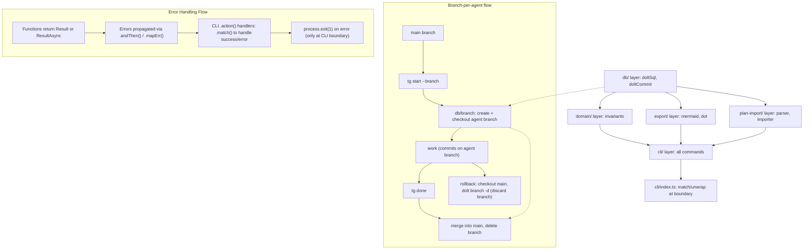

---
triggers:
  files: ["src/domain/**", "src/db/**", "src/plan-import/**", "src/export/**"]
  change_types: ["create", "refactor"]
  keywords: ["architecture", "layer", "data flow"]
---

# Architecture

The Task Graph system is built around a Command Line Interface (CLI) that interacts with a Dolt database, acting as a Git-like version-controlled data store. This architecture is designed for reliability, determinism, and ease of audit.

## Data Store

- **Dolt Repository**: The core data for plans, tasks, dependencies, events, and decisions is persisted in a Dolt repository. This repository is typically located within the project at `.taskgraph/dolt/` or an adjacent directory.
- **Access Method**: Data access is primarily via the `dolt sql` CLI command. This approach, executed through `execa` in TypeScript, prioritizes robustness and avoids the need for a persistent MySQL server connection.
- **Version Control**: All data modifications are treated as Dolt commits, providing a complete audit trail of changes with meaningful messages.

## Execution Surface (CLI)

The agent interacts with the Task Graph system through a small, safe CLI, `tg`. This CLI is built using `commander.js` and is the primary interface for creating, managing, and querying the task graph.

### Repository Layout

The project adheres to a structured repository layout to separate concerns and improve maintainability:

```
  src/
    cli/           # Commander.js commands and CLI utilities
    db/            # Dolt connection, commit, and migration logic
    domain/        # Core business logic: types, Zod schemas, invariants, error definitions
    export/        # Graph visualization logic (Mermaid, DOT)
    plan-import/   # Markdown plan parsing and database import logic
  package.json
  tsconfig.json
  plans/             # Directory for Cursor Plan docs (narrative layer)
  AGENT.md           # Agent contract and operating protocol
  .taskgraph/
    config.json      # Local configuration for the Task Graph system
```

### Configuration (`.taskgraph/config.json`)

| Field                  | Type                      | Description                                                                                        |
| :--------------------- | :------------------------ | :------------------------------------------------------------------------------------------------- |
| `doltRepoPath`         | string                    | Path to the Dolt repository (required).                                                            |
| `learningMode`         | boolean (optional)        | When true, orchestrator may append learnings to agent files after runs.                            |
| `context_token_budget` | number or null (optional) | Max tokens for `tg context` output; null or omitted = unlimited. Typical: 4000–8000.               |
| `mainBranch`           | string (optional)         | Branch to merge agent branches into when using `tg start --branch` and `tg done`. Default: `main`. |

- **Agent branches**: Use `tg start <taskId> --branch` to create and checkout a Dolt branch for that task. When you run `tg done <taskId>`, the CLI merges that branch into the main branch (or `mainBranch` from config) and deletes the agent branch. If the merge has conflicts, an error is reported and the branch is left for manual resolution.

### Dolt branching (branch-per-agent)

Branch-per-agent is an **opt-in** pattern that gives each task its own Dolt branch. Use it when you want rollback safety or isolation for multi-agent work.

- **When to enable**: Pass `tg start <taskId> --branch` when starting a task. No config flag is required; branching is chosen per task at start time.
- **What happens**: A branch is created from the current HEAD (e.g. `main`) and checked out. All commits for that task (start event, notes, done) happen on that branch. The branch name is derived from the task (stored in the start event).
- **Completion**: Running `tg done <taskId>` merges the agent branch into the main branch (or `mainBranch` from config) and then deletes the agent branch. If the merge has conflicts, the CLI reports an error and does not delete the branch; you resolve conflicts manually, merge, and delete the branch yourself.
- **Rollback**: To discard a task’s changes without merging, checkout the main branch and delete the agent branch (e.g. `dolt checkout main` then `dolt branch -d <agent-branch>` from the Dolt repo). The task remains in the graph; you can mark it canceled or leave it for cleanup. Rollback is safe because the main branch is unchanged until you merge.

### Multi-machine sync and workflow

The task graph lives in a Dolt repository (`.taskgraph/dolt/` by default). Dolt supports remotes and push/pull, so the same graph can be shared across machines (e.g. different laptops or CI).

- **Sync today**: There is no `tg sync` command yet. To sync between machines, use Dolt from the repo root: add a remote (e.g. `dolt remote add origin <url>` from inside `.taskgraph/dolt/`), then `dolt pull` / `dolt push` as needed. Each machine needs the same `.taskgraph/` layout and config pointing at the Dolt repo.
- **Planned sync**: A future `tg sync` (or equivalent) may wrap Dolt fetch/pull/push and optionally use a **remote** entry in `.taskgraph/config.json` (e.g. `remoteUrl`) so the CLI can pull/push without running Dolt commands manually.
- **Remote config (planned)**: Config may gain an optional `remoteUrl` (or similar) to designate the default Dolt remote for sync. Until then, remotes are configured only via Dolt in `.taskgraph/dolt/`.
- **Multi-machine workflow**: On a new machine, clone the project (or copy it) so `.taskgraph/dolt/` exists; if the graph is in a shared remote, run `dolt pull` from the Dolt repo to get latest. Run `tg` commands as usual; worktrees and branch-per-agent work per machine. Push changes from the Dolt repo when you want to share them.

## Data Flow and Error Handling

The system employs a bottom-up data flow with `neverthrow` Result types for explicit error handling.



- **`db/` layer**: Handles direct interaction with Dolt. Functions like `doltSql` and `doltCommit` return `ResultAsync` to encapsulate potential database operation failures.
- **`domain/` layer**: Contains core business logic and invariants. Functions here return `Result` (for synchronous operations) or `ResultAsync` (for operations involving DB calls) to ensure all possible failure states are explicitly handled.
- **`export/` and `plan-import/` layers**: These layers process data from the database or external files and transform it. The plan-import parser and importer support the [enhanced plan format](plan-format.md) (file trees, risks, tests, per-task suggested changes), which is stored on plan and task rows and surfaced by `tg context`.
- **`cli/` layer**: The command handlers in this layer orchestrate the calls to the underlying domain, database, and other service layers. They use `neverthrow`'s `.match()` method at the outer boundary of the `action` handler to gracefully respond to the user with success messages or error details, terminating the process with `process.exit(1)` on error.
- **Error Types**: A custom `AppError` interface with an `ErrorCode` enum provides a structured way to categorize and handle different types of errors consistently across the application. See [Error Handling](error-handling.md) for more details. Multi-agent adds `TASK_ALREADY_CLAIMED` when `tg start` is attempted on an already-claimed task without `--force`.

### Agent escalation ladder

Task execution follows an **escalation ladder**: re-dispatch (same or adjusted sub-agent) → direct execution (orchestrator) → fixer (stronger model) → escalate to human. The **escalation decision tree** is defined in [.cursor/rules/subagent-dispatch.mdc](../.cursor/rules/subagent-dispatch.mdc); it specifies when to re-dispatch, when the orchestrator should do the task directly, and when to escalate to human (e.g. credentials, ambiguous intent, safety/approval, repeated failure). The **fixer** sub-agent ([.cursor/agents/fixer.md](../.cursor/agents/fixer.md)) is used when the orchestrator escalates a failed task to a stronger model after one or more implementer (and optionally reviewer) attempts; the fixer receives task context, failure feedback, and the current diff.

### Cross-Task Communication via Notes

The `event` table's `kind = 'note'` rows serve as the boundary-crossing mechanism between agent perspectives. An implementer (introspective: focused on one task) writes notes when it discovers issues beyond its scope; the orchestrator and future implementers (connective: focused on patterns across tasks) read those notes via `tg context`. See [agent-strategy.md](agent-strategy.md#communication-notes-as-cross-dimensional-transmission) for the full model.

### Auto-Migration

A `preAction` hook runs before every CLI command (except `init` and `setup`), calling `ensureMigrations()` to apply any pending idempotent migrations. This eliminates the "two worlds" problem where agents encounter a stale schema.
