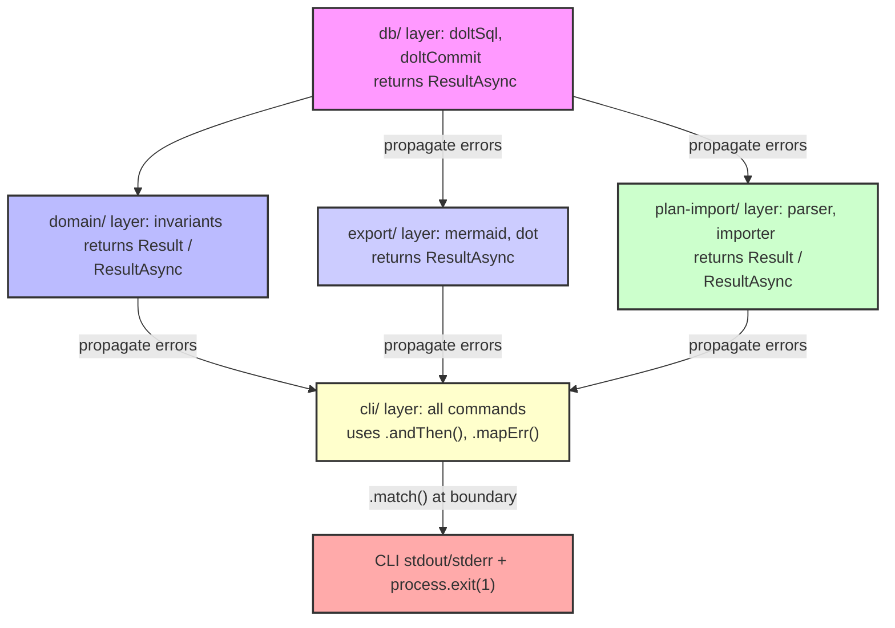

---
triggers:
  files: ["src/domain/errors.ts", "src/domain/**"]
  change_types: ["create", "modify"]
  keywords: ["error", "AppError", "ErrorCode"]
---

# Error Handling

The Task Graph system prioritizes reliability and determinism, making robust error handling a first-class requirement. We utilize the `neverthrow` library to manage errors explicitly, replacing traditional `throw`/`try-catch` patterns with `Result` and `ResultAsync` types.

## Neverthrow Philosophy

`neverthrow` is a TypeScript library that allows functions to explicitly declare their success and failure outcomes using a `Result` type (or `ResultAsync` for asynchronous operations). This approach eliminates the need for exceptions, making error paths clearer and ensuring that errors are handled at the appropriate level.

-   `Result<T, E>`: Represents an operation that can either succeed with a value of type `T` (an `ok` result) or fail with an error of type `E` (an `err` result).
-   `ResultAsync<T, E>`: Similar to `Result`, but for asynchronous operations. It wraps a `Promise` that resolves to a `Result<T, E>`.

This pattern forces callers to acknowledge and handle potential failures, leading to more resilient code.

## `AppError` Interface and `ErrorCode` Enum

All errors within the Task Graph system conform to the `AppError` interface and are categorized by an `ErrorCode` enum, defined in [`src/domain/errors.ts`](src/domain/errors.ts).

```typescript
export enum ErrorCode {
  // DB errors
  DB_QUERY_FAILED = 'DB_QUERY_FAILED',
  DB_COMMIT_FAILED = 'DB_COMMIT_FAILED',
  DB_PARSE_FAILED = 'DB_PARSE_FAILED',

  // Domain errors
  TASK_NOT_FOUND = 'TASK_NOT_FOUND',
  PLAN_NOT_FOUND = 'PLAN_NOT_FOUND',
  INVALID_TRANSITION = 'INVALID_TRANSITION',
  TASK_NOT_RUNNABLE = 'TASK_NOT_RUNNABLE',
  CYCLE_DETECTED = 'CYCLE_DETECTED',
  EDGE_EXISTS = 'EDGE_EXISTS',

  // Config errors
  CONFIG_NOT_FOUND = 'CONFIG_NOT_FOUND',
  CONFIG_PARSE_FAILED = 'CONFIG_PARSE_FAILED',

  // Import errors
  FILE_READ_FAILED = 'FILE_READ_FAILED',
  PARSE_FAILED = 'PARSE_FAILED',

  // Validation
  VALIDATION_FAILED = 'VALIDATION_FAILED',
}

export interface AppError {
  code: ErrorCode;
  message: string;
  cause?: unknown; // Original error or underlying cause
}

// Helper to construct AppError instances
export const buildError = (code: ErrorCode, message: string, cause?: unknown): AppError => ({
  code,
  message,
  cause,
});
```

Each `AppError` provides:
-   `code`: A machine-readable `ErrorCode` for programmatic handling.
-   `message`: A human-readable message describing the error.
-   `cause`: An optional property to store the original exception or underlying cause for debugging purposes.

## Error Flow from DB to CLI

The error handling strategy follows the application's architectural layers, propagating `Result` or `ResultAsync` types upwards until the top-level CLI command handler.



1.  **Bottom Layers (`db/`, `domain/`, `export/`, `plan-import/`)**: Functions in these layers perform operations and return `Result` or `ResultAsync`. They use `ok(value)` for success and `err(buildError(code, message, cause))` for failure.
2.  **Intermediate Layers (`domain/`, `export/`, `plan-import/`, called by `cli/`)**: These layers chain operations using `neverthrow`'s combinators like `.andThen()` and `.mapErr()`. Errors are transformed or passed through without being `throw`n.
3.  **CLI Boundary (`cli/*.ts` `action` handlers)**: This is the designated boundary for explicit error handling. Each command's `action` handler awaits the final `ResultAsync` and uses `.match()`:
    -   On `ok` result: The successful data is processed and printed to `stdout`.
    -   On `err` result: The `AppError` is caught, an error message is printed to `stderr` (with JSON output for `--json` flag), and `process.exit(1)` is called to indicate a failed execution.

This structured approach ensures that all potential errors are accounted for and handled consistently, contributing to the system's overall reliability and determinism.