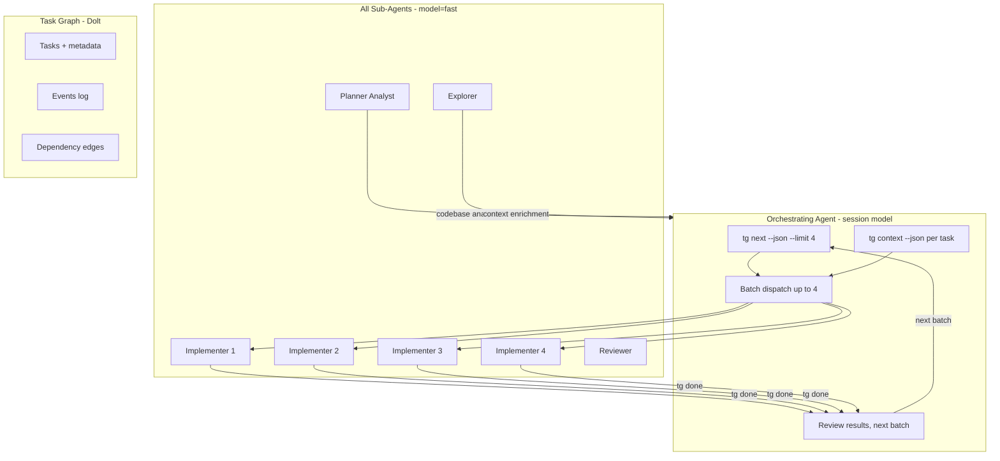
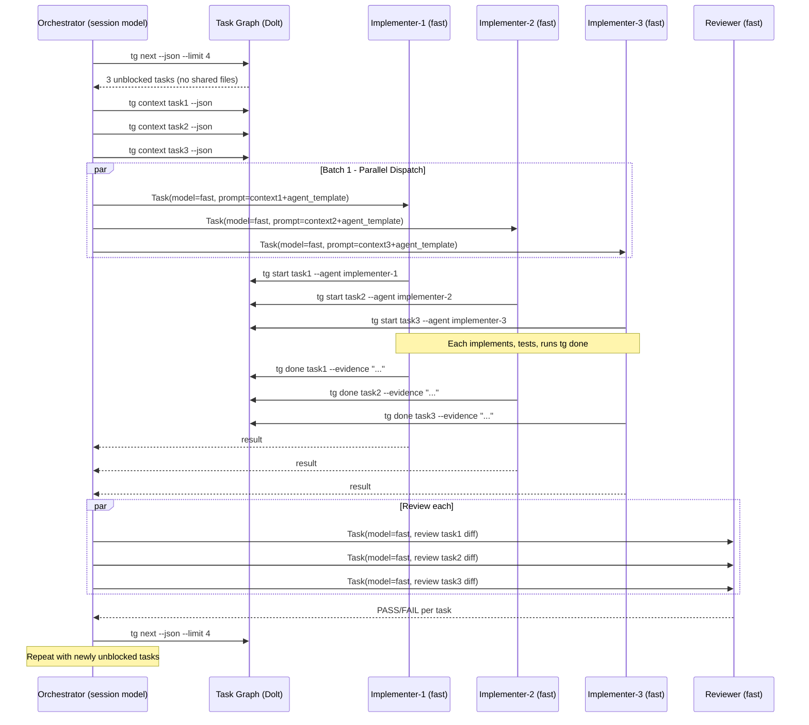

## Analysis

### The Core Insight

**Better prompts with tight context compensate for cheaper models.** This is the lesson from both reference projects:

- **gt-toolkit** dispatches Haiku for codebase exploration — the cheapest model does the most volume of work
- **superpowers** achieves quality through fresh context per sub-agent and two-stage review, not model escalation
- **Task Graph** already provides structured context (`tg context --json`) with intent, suggested changes, domain docs, skill guides, and related prior work

The approach: **all sub-agents use model="fast" (1/10 cost)**. The orchestrator (session model) handles coordination, review oversight, and complex reasoning. The sub-agents are scoped to bounded tasks with full context injected — the fast model is sufficient when it knows exactly what to do.

### Cost Model

With `fast` at 1/10 cost, dispatching 4 parallel fast sub-agents costs less than running 1 task on the session model. A plan with 8 independent tasks:

- **Before**: 8 sequential tasks on expensive model = 8x cost units
- **After**: 2 batches of 4 parallel fast agents = ~1.6x cost units (8 * 0.1 * 2 for retry headroom)

That's roughly a **5x cost reduction** with **4x throughput improvement** on independent work.

### Sub-Agent Architecture

### Parallel Dispatch Flow

### Key Design Decisions

1. **All sub-agents use model="fast".** No heuristic, no per-task model selection. The orchestrator (session model) handles complex reasoning; sub-agents do bounded work with full context injected. This is the gt-toolkit lesson: cheap models + good prompts > expensive models + vague prompts.

2. **Parallel-first execution.** The primary dispatch pattern is batching: find up to 4 unblocked tasks, dispatch them concurrently, review results, repeat. Sequential execution is the fallback, not the default.

3. **Agents are prompt templates, not executable code.** They live as `.md` files in `.cursor/agents/` and are interpolated by the orchestrating agent at dispatch time. This matches superpowers' approach and avoids adding runtime dependencies.

4. **Sub-agents wrap the tg lifecycle.** Every implementer sub-agent runs `tg start` and `tg done` — the task graph remains the single source of truth for what's in progress and what's complete. Dolt handles concurrent writes from parallel agents.

5. **File conflict detection before parallel dispatch.** The orchestrator checks whether unblocked tasks share files (via `file_tree` or `suggested_changes`) and only parallelizes truly independent work.

6. **Fail-fast with escalation.** If a fast sub-agent fails twice on a task, the orchestrator falls back to direct execution on the session model. This prevents cheap model failures from blocking progress.

### Comparison with Reference Projects

| Aspect | gt-toolkit | superpowers | Our system |
|--------|-----------|-------------|------------|
| Model tiers | 3 (Haiku/Sonnet/Opus) + external | 1 (inherit) | 2 (all sub-agents fast; orchestrator session model) |
| Dispatch | TOML formulas, background jobs | Controller dispatches sub-agents | Cursor rules dispatch via Task tool, model="fast" |
| Context passing | File-based (.tmp artifacts) | Controller extracts text inline | tg context --json interpolated into prompt |
| Review | Multi-model consensus (3x parallel) | Two-stage (spec + quality) | Single-stage (fast model, spec + quality combined) |
| Parallel execution | Yes (needs-based DAG) | No (sequential only) | Yes (tg next finds independent tasks from Dolt) |
| Task tracking | Beads/molecules | None (plan markdown) | Task graph (Dolt, concurrent writes, full events) |
| Cost model | Varies by formula | Session model cost | ~10% per sub-agent; 4x parallel throughput |

### Open Questions

1. Should the reviewer agent be split into spec-reviewer and quality-reviewer (like superpowers) or kept as one? Starting with one; can split if review quality is insufficient.
2. Should explorer output be persisted as a `tg note` on the task for future reference? Leaning yes — it creates a searchable record.
3. Dolt concurrent write safety: multiple sub-agents will call `tg start` and `tg done` at the same time. Need to verify Dolt handles concurrent writes gracefully (it should — it's a SQL database — but worth confirming in testing).

<original_prompt>
Create a collection of specialized sub-agents for Cursor, inspired by gt-toolkit's formulas
(https://github.com/Xexr/gt-toolkit/tree/main/formulas) and superpowers' skills
(https://github.com/obra/superpowers). Sub-agents should leverage the task graph for context
(tg context), use cheap models (model="fast") for ALL dispatched work, and enable parallel
execution of unblocked tasks pulled from Dolt. Multiple agents should be able to work on
independent tasks concurrently — this is the primary performance win. The system should be
added to .cursor/ and also scaffolded via tg setup for new repos.
</original_prompt>
