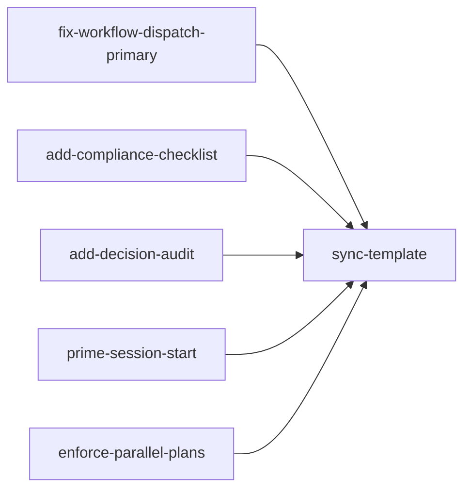

## Analysis

### The contradiction

`taskgraph-workflow.mdc` is `alwaysApply: true` — it loads on every request. Its execution loop (lines 31-44) describes the orchestrator doing start → work → done itself, with sub-agent dispatch as an "(optional)" subsection. `AGENT.md` says dispatch is **MANDATORY** and skipping it is a "critical failure." The always-applied rule wins the agent's attention, so the orchestrator defaults to direct execution.

### The tg next issue

`tg next` code is correct — it queries for all `todo` tasks with 0 unmet blockers, default `--limit 10`. The problem is plan design: when every task has `blockedBy: [previous-task]`, only 1 task is ever runnable. The orchestrator can call `tg next --limit 3` and still get 1 result. Task `enforce-parallel-plans` addresses this by requiring plans to have ≥2 parallel-ready tasks.

### Dependency graph

Tasks A–E are fully independent — all 5 can run in parallel (they touch different files or different sections). Task F (sync-template) depends on all 5.

### Existing enforcement vs gaps

| Mechanism | What it does | Gap |
|---|---|---|
| memory.mdc "update last" | Forces memory write before response complete | No equivalent for dispatch compliance |
| AGENT.md "MANDATORY" language | States dispatch required | No verification hook; orchestrator can ignore |
| Critique checklist | Reviews plan quality | Only in subagent-dispatch.mdc; plan-authoring doesn't enforce parallelism |
| session-start.mdc | Runs tg status | Doesn't remind key constraints |
| taskgraph-workflow.mdc | Describes execution | Contradicts AGENT.md by framing dispatch as optional |

<original_prompt>
Is there anything else we can do to sharpen up the orchestrator? Make a plan. Also check pnpm tg returns a list of tasks that are actionable (not blocked by dependencies).
</original_prompt>
