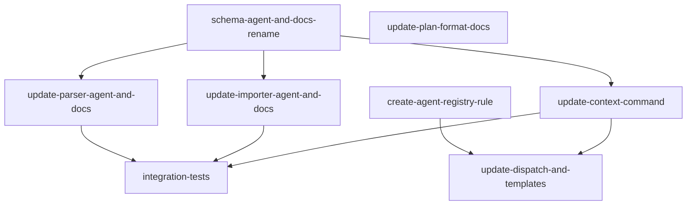

## Analysis

This plan addresses three related changes that reinforce each other:

### 1. Sub-agent registry rule

Currently, knowledge of which sub-agents exist is scattered across `.cursor/agents/README.md`, `subagent-dispatch.mdc`, and `AGENT.md`. A dedicated registry rule (`available-agents.mdc`) creates a single source of truth that planners and orchestrators reference when deciding which agent to assign to a task. This rule ships in the template so consuming projects get it too.

### 2. Agent field on tasks

The `agent` field gives plan authors explicit control over which sub-agent executes each task. Currently the orchestrator always defaults to the implementer, with explorer used only when the orchestrator judges it appropriate. With an explicit field:

- `changeType: investigate` tasks can be assigned `agent: explorer`
- Custom agents (e.g. test-coverage-scanner) can be assigned directly
- The orchestrator still falls back to `implementer` when agent is not specified

The field is stored on the task row (VARCHAR(64) NULL) so `tg context` can surface it and the dispatch logic can use it.

### 3. Domain → docs rename

The `domain` concept maps to `docs/<slug>.md` files. Calling it "docs" aligns with the actual folder name and is more adaptable — a doc slug doesn't have to represent a "domain" in the DDD sense. The rename touches:

- DB: `task_domain` table → `task_doc` table, `domain` column → `doc`
- Types: `TaskDomainSchema` → `TaskDocSchema`
- Parser: accepts both `docs` (new) and `domain` (backward compat) in YAML
- Importer: writes to `task_doc` table
- Context: outputs `docs` and `doc_paths` instead of `domains` and `domain_docs`
- Plan format docs and authoring rules

### Backward compatibility

The parser accepts both `domain` and `docs` in plan YAML. The migration handles both fresh installs (create `task_doc` from scratch) and upgrades (rename from `task_domain`). The context output shape changes (breaking for JSON consumers), but all consumers (dispatch rule, agent templates) are updated in the same plan.

## Dependency graph

```
Parallel start (3 unblocked):
  ├── create-agent-registry-rule
  ├── schema-agent-and-docs-rename (migration + types)
  └── update-plan-format-docs (docs + authoring rule)

After schema-agent-and-docs-rename:
  ├── update-parser-agent-and-docs
  ├── update-importer-agent-and-docs
  └── update-context-command

After create-agent-registry-rule + update-context-command:
  └── update-dispatch-and-templates

After update-parser + update-importer + update-context:
  └── integration-tests
```



<original_prompt>
I have realised that when we break a plan down into tasks we have a good opportunity to specify the sub-agent we want to execute a task.

this will require a new sub-agent rule for using tg this rule would be updated over time so that any orchistrator/query knows what sub-agents are available to use generally. We should capture what the purpose/specialisation of each sub agent is and any constraints it is meant to operate within.

the planning rule will then need to be updated as well to use this so that when it specifies tasks it identifies the agent to be used.

for this to work we are going to have to change the schema of our tasks and the frontmatter of our plans.

While we are doing this I also realised that I would like to change the name domain to docs inside of the task schema. Its what we call it at the folder level and it is more adaptable.

make me a plan for these changes
</original_prompt>
