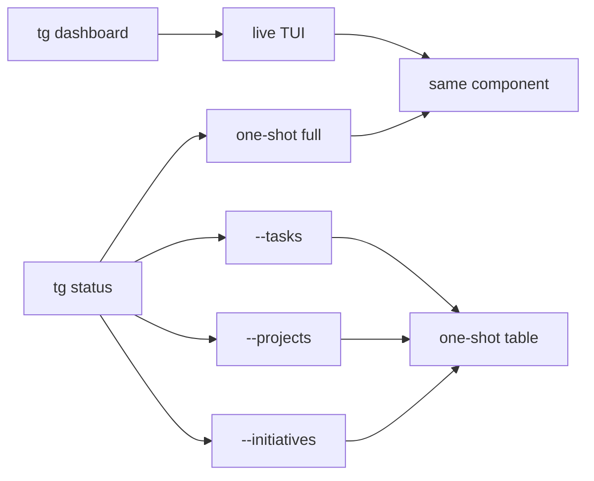

## Analysis

**tg dashboard** is a separate command for the live-updating TUI. **tg status** is snapshot-only: it renders the same component (Completed, Active Plans, Active Work, Next Runnable) once and exits. No `tg status --dashboard` — the dashboard is its own command.

- **tg dashboard:** Live TUI; same data and layout as status snapshot. OpenTUI when available, else setInterval + ANSI clear + shared snapshot render. Filters: --plan, --domain, --skill, --change-type, --all. No --json.
- **tg status:** One-shot only. Full view (same sections as dashboard content) or focused views (--tasks, --projects, --initiatives) with --filter. Uses boxen for section boxes. No live path.
- **Shared component:** One function (e.g. renderStatusSnapshot(StatusData) or printHumanStatus) used by status one-shot and by dashboard fallback so the UI is identical.

## Dependency graph

```text
Parallel start (1 unblocked):
  └── tui-stack

After tui-stack (parallel):
  ├── add-dashboard-command
  ├── status-snapshot-only
  ├── tasks-view
  ├── projects-view
  └── initiatives-view

After add-dashboard-command, status-snapshot-only, tasks-view, projects-view, initiatives-view:
  └── docs-and-tests
```

## Proposed changes

- **package.json:** Add boxen, @opentui/core.
- **src/cli/dashboard.ts:** New command; fetchStatusData + OpenTUI or fallback loop; shared snapshot render.
- **src/cli/status.ts:** Remove --dashboard and all live paths; snapshot only; boxen sections; keep --tasks, --projects, --initiatives one-shot.
- **src/cli/tui/:** Boxen helpers; OpenTUI live renderer; fallback uses same render as status.
- **src/cli/index.ts:** Register dashboardCommand(program).
- **Tests:** tg dashboard (SIGINT, no --json); tg status snapshot and focused views.
- **cli-reference.md:** tg dashboard section; tg status snapshot-only, no --dashboard.

## Mermaid



## Related plans

- **Status Live TUI** (26-02-27_status_live_tui.md) is retired. Live TUI is now tg dashboard.

## Original prompt

<original_prompt>
we dont even need tg status --dashboard if tg dashboard exists.
tg dashboard = live TUI. status = snapshot (similar component, not live).
Update the plan to include tasks for this.
</original_prompt>
