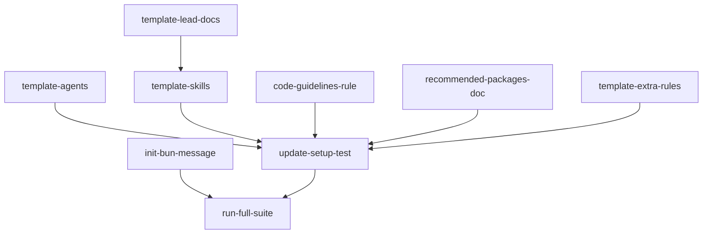

## Analysis

### Current state

The `tg setup` command scaffolds docs and Cursor rules into new projects, but the template is significantly behind the main project:

- **Agents**: Template has 6 of the main project's 14 agents. Missing: debugger, documenter, fixer, investigator (the four most impactful for quality).
- **Skills**: Template has zero `.cursor/skills/`. The main project has 11 mature skills (plan, investigate, debug, review, work, report, rescope, review-tests, risk, meta, create-hook).
- **Lead docs**: Template has no `docs/leads/`. Skills reference these for orchestration patterns.
- **Rules**: Template is missing `no-hard-deletes.mdc` (data safety) and `subagent-reports.mdc` (report quality).
- **Guidelines**: No coding standards or package recommendations in the template.
- **Init messaging**: No guidance about Bun or next steps after `tg init`.

### Design decisions

1. **Skills go in `.cursor/skills/`** (not `docs/skills/`): The main project uses Cursor's native skill system. `docs/skills/` is a separate layer for task-context guides. Both coexist.

2. **Code guidelines vs code-standards**: `code-guidelines.mdc` is generic/universal (for any project). `code-standards.mdc` is TaskGraph-specific (neverthrow, db/domain layering). The template gets `code-guidelines` only.

3. **Recommended packages as doc, not rule**: `docs/recommended-packages.md` is a reference doc. The `code-guidelines.mdc` rule tells agents to check it before installing packages. No separate rule needed.

4. **Verbatim copy for agents/leads**: Agent prompt templates and lead docs are copied from the main project without modification. They're already well-structured and project-agnostic.

5. **Skills need path adjustment**: Skills reference lead docs with relative paths. Since both live in the same relative positions in the template as in the main project, most paths should be correct. The implementer should verify.

### Out of scope

- Syncing the existing 6 template agents with main project versions (separate maintenance task)
- Adding test-quality-auditor, test-infra-mapper, test-coverage-scanner agents (niche; can be added later)
- Adding `changed-files-default.mdc` or `docs-sync.mdc` to template (tg-specific validation rules)
- `tg setup` UX changes (e.g. progress bars, categories)
- Automatic Bun installation from `tg init`

## Dependency graph

```
Parallel start (6 unblocked):
  ├── init-bun-message (src/cli/init.ts)
  ├── template-agents (4 agent files + available-agents + README)
  ├── template-lead-docs (10 lead doc files)
  ├── code-guidelines-rule (.cursor/rules/code-guidelines.mdc)
  ├── recommended-packages-doc (docs/recommended-packages.md)
  └── template-extra-rules (no-hard-deletes + subagent-reports)

After template-lead-docs:
  └── template-skills (11 skill directories with SKILL.md + companions)

After all template work:
  └── update-setup-test (extend integration test assertions)

After init-bun-message + update-setup-test:
  └── run-full-suite (build + gate:full)
```



<original_prompt>
I think we are approaching a new version to release of the app. Integration tests are all falling into place and we are getting the missing piece that is initiatives in.

now we need to make it that what we have learned is also brought to those that use taskgraph. so when tg init runs we tell users that they should use bun for testing and to install it globably. then we want to update our templates in tg so that the new project initialisise with the same skills and angents as tg. also that we provide code guidelines for the project to follow.

baiscially we immediatily increase the qualitiy of output for the new codebase.

we can also start curatining a recomended set of packages so that when agents have an idea of what needs to be installed they pick off this list firest.

first set: zod, react-query, lodash, uuid, casl, ts-pattern, knex, dolt, ts-rest, react-flow, ag-grid, date-fns, mjml
</original_prompt>
