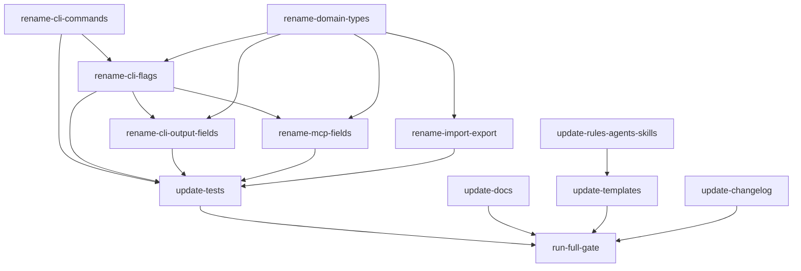

## Analysis

### Current state

The task-graph database already has the `plan` table renamed to `project`, with a `plan` view for backward compatibility. Application code queries the `project` table. However, the entire surface area — CLI commands, flags, types, output fields, documentation, rules, agent prompts, skill files, and templates — still uses "plan" to mean the task-graph entity.

### Naming convention (going forward)

| Term        | Meaning                                          | Where it lives                          |
| ----------- | ------------------------------------------------ | --------------------------------------- |
| **Plan**    | Markdown strategic document, pre-import analysis | `plans/` directory, plan-authoring rule |
| **Project** | Task-graph entity (imported from a plan)         | `project` table in Dolt, CLI commands   |

### Column names

Column names (`plan_id`, `plan_title` alias) are **not** renamed in this plan. Column renames require schema migration, FK updates, and carry higher risk. They can be addressed in a follow-up if desired. Application code will use `project_id` for variable names but still reference `plan_id` in SQL.

### Backward compatibility strategy

- **CLI commands**: `tg plan` becomes a deprecated alias for `tg project`
- **CLI flags**: `--plan` becomes a deprecated alias for `--project`
- **Domain types**: Old names (`Plan`, `PlanSchema`, `PLAN_NOT_FOUND`) kept as re-exports
- **MCP fields**: Old field names included alongside new ones for one version
- **Deprecation removal**: Next major version

### Out of scope

- Renaming database columns (`plan_id` -> `project_id`)
- Renaming the `src/plan-import/` directory (it imports plans into projects — name is accurate)
- Renaming the `crossplan` command name (it's a verb/action, not an entity reference)
- Updating content of old project records in the database (low value, high risk of over-rewriting)

## Dependency graph

```
Parallel start (3 unblocked):
  ├── rename-cli-commands (tg plan -> tg project command)
  ├── rename-domain-types (Plan -> Project types, errors)
  ├── update-docs (documentation updates)
  ├── update-rules-agents-skills (rules, agents, skills)
  └── update-changelog (CHANGELOG entry)

After rename-cli-commands + rename-domain-types:
  ├── rename-cli-flags (--plan -> --project across all commands)
  └── rename-import-export (import/export module renames)

After rename-cli-flags + rename-domain-types:
  ├── rename-cli-output-fields (status, show, table, boxen, crossplan output)
  └── rename-mcp-fields (MCP tool fields and parameters)

After all code changes:
  └── update-tests (update all test files)

After update-rules-agents-skills:
  └── update-templates (template files mirror rules/agents/skills)

After everything:
  └── run-full-gate (build + gate:full verification)
```



<original_prompt>
I'd like to make a plan to systematically move the entire codebase to using the word "project" instead of "plan" where it refers to the task-graph entity. Plans (markdown strategic documents in plans/) keep the word "plan". Once imported into the task graph, they become "projects". Old projects in the database should have their content updated for references to plans. The CLI commands, flags, types, output, docs, rules, agents, skills, and templates all need updating.
</original_prompt>
