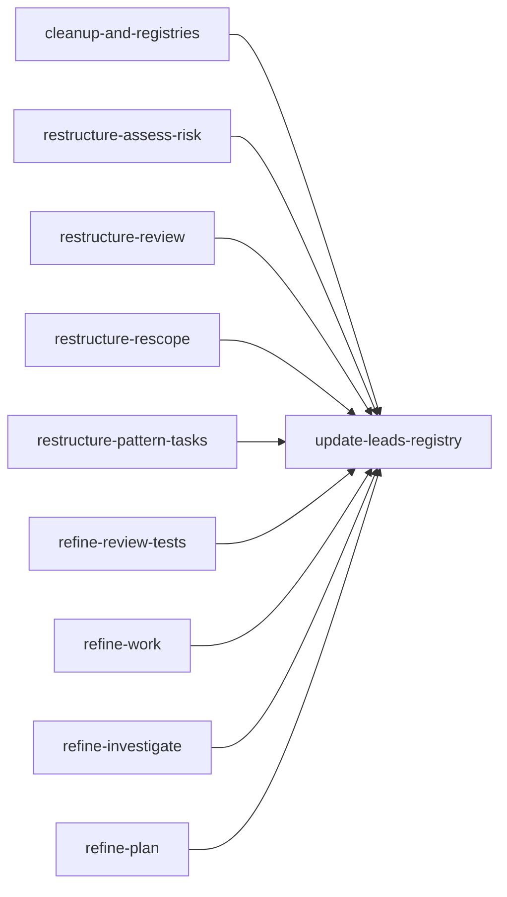

## Analysis

This plan brings all 9 remaining skills (after deleting 2 duplicates) to the "agentic lead" pattern. The two exemplar skills (review-tests, work) need only refinement (3 missing sections each). The good skills (investigate, plan) also need refinement. The needs-work skills (assess-risk, review, rescope, pattern-tasks) need full restructuring plus new lead docs.

The `/create-hook` skill is explicitly labeled as a utility — not every skill needs to be an agentic lead.

Key architectural decisions:

- **assess-risk and pattern-tasks have no sub-agents** — they run the orchestrator directly. This is documented explicitly rather than forced into a sub-agent pattern.
- **Permission propagation is a standard section** — every agentic skill declares lead permission + propagation rule + sub-agent table.
- **Mermaid graphs target 5-15 nodes** — enough to show the decision structure without becoming a maintenance burden.

## Dependency graph

```
Parallel start (9 unblocked):
  ├── cleanup-and-registries (delete risk/, meta/; update agents registry; label create-hook)
  ├── restructure-assess-risk (lead doc + SKILL.md)
  ├── restructure-review (lead doc + SKILL.md)
  ├── restructure-rescope (lead doc + SKILL.md)
  ├── restructure-pattern-tasks (merge meta + lead doc + SKILL.md)
  ├── refine-review-tests (add 2 sections)
  ├── refine-work (add 3 sections)
  ├── refine-investigate (add 3 sections)
  └── refine-plan (add 3 sections)

After restructure-assess-risk, restructure-review, restructure-rescope, restructure-pattern-tasks:
  └── update-leads-registry (update docs/leads/README.md)
```

## Mermaid — Plan execution flow



<original_prompt>
/plan for all improvements.

also consolidate these into the short versions /risk and /meta

/risk and /assess-risk — Nearly identical content. Keep assess-risk (better name, matches skill trigger), delete risk.
/meta and /pattern-tasks — Nearly identical. Keep pattern-tasks (more descriptive), update meta to be an alias or merge cross-project behavior into pattern-tasks as a scope option.
</original_prompt>
