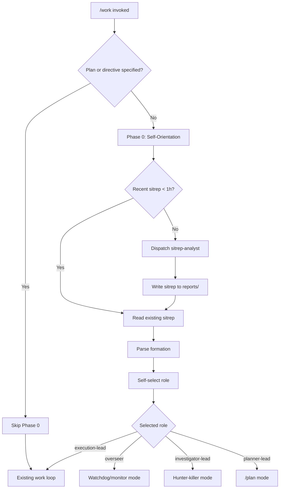

# Analysis

## Why this approach

The current `/work` skill has a gap: when called without a specific plan, it jumps straight into `tg next --json` (multi-plan mode) and starts grinding. There's no step where it assesses the overall situation, decides what's most important, or coordinates with other potential `/work` instances.

This is fine for a single-agent, single-plan workflow. But as the project grows (multiple plans, initiatives, and the possibility of the human spawning multiple `/work` sessions), the skill needs a "look before you leap" phase.

### Patterns drawn from external agentic systems

**OpenAI Swarm — Routines and Handoffs**: Swarm's key insight is that agent coordination should be lightweight. Agents follow "routines" (instruction sets) and "hand off" to each other based on expertise. Our formation model mirrors this: the sitrep defines routines (role descriptions), and self-selection is a form of handoff (the agent picks the routine that matches the situation).

**Cursor Parallel Agents**: Cursor runs up to 8 agents in parallel with git worktree isolation. The key learning is that fresh agents per task outperform context-accumulating agents. Our model follows this: each `/work` instance starts fresh, reads the sitrep for shared context, and picks a clean role.

**Swarm Tools — Coordinator-Worker Topology**: The coordinator pattern (one agent orchestrates, others execute) maps directly to our overseer role. The coordinator "decomposes tasks, assigns them to workers, monitors progress, handles conflicts, and aggregates results — but crucially never performs the work itself."

**Claude Code Agent Teams**: The experimental "teammates" feature shows that direct communication through shared task lists is more effective than reporting through a central intermediary. Our sitrep serves as this shared task list — all `/work` instances read it, and the task graph (`tg status`, `tg next`) provides the live coordination layer.

**Anti-pattern avoidance**: Research consistently shows that beyond 5 agents, monitoring complexity explodes. Our formation model caps roles (overseer = max 1, investigator-lead = max 1) and lets the human decide total cluster size. The sitrep's formation section makes the recommended size explicit so the human can make an informed decision.

### What stays the same

The entire existing `/work` loop is untouched. Phase 0 is purely additive — it runs before the loop and decides which mode to enter. If you call `/work` with a plan, Phase 0 is skipped entirely.

### What's new

1. **Sitrep** — A timestamped report combining meta, investigate, and status data
2. **Formation** — A recommended set of lead roles with cardinality
3. **Self-selection** — Each `/work` instance picks an available role
4. **Role-specific entry** — Different roles enter different workflows (execution loop, watchdog, hunter-killer, planner)

## Dependency graph

```
Parallel start (2 unblocked):
  ├── define-sitrep-schema (documenter - sitrep format and formation schema)
  └── define-lead-roles (documenter - cardinality and self-selection rules)

After define-sitrep-schema + define-lead-roles:
  ├── create-sitrep-analyst (implementer - agent template)
  └── update-execution-lead-doc (documenter - lead doc update)

After create-sitrep-analyst:
  └── implement-sitrep-generation (implementer - work skill modification)

Parallel with implement-sitrep-generation:
  └── update-multi-agent-docs (documenter - strategy and multi-agent docs)

After implement-sitrep-generation:
  └── add-tests-sitrep (implementer - validation tests)

After all above:
  └── run-full-suite (implementer - gate:full)
```

## Mermaid diagram — Self-orientation flow



## Micro-cluster formation example

Human spawns 3 `/work` instances for a project with 2 active plans and 15 runnable tasks:

```
Instance 1 (first to start):
  - Generates sitrep (none exists)
  - Formation suggests: 2 execution-leads, 1 overseer
  - Self-selects: execution-lead for Plan A (most runnable tasks)
  - Enters work loop for Plan A

Instance 2 (starts 30s later):
  - Reads existing sitrep (< 1h)
  - Sees: 1 execution-lead active (Plan A), overseer slot open
  - Self-selects: execution-lead for Plan B (unclaimed plan)
  - Enters work loop for Plan B

Instance 3 (starts 1min later):
  - Reads existing sitrep (< 1h)
  - Sees: 2 execution-leads active, overseer slot open
  - Self-selects: overseer
  - Enters watchdog/monitor mode
  - Periodically refreshes sitrep, monitors stalls, manages formation
```

## Open questions

1. **Overseer implementation depth** — Phase 1 defines the overseer role conceptually. The actual overseer workflow (beyond the existing watchdog protocol) needs design. Should it be a separate skill or a mode within /work? Current plan: mode within /work, leveraging existing watchdog protocol + sitrep refresh.

2. **Planner-lead scope** — When a /work instance becomes planner-lead, it essentially runs /plan. Should it auto-import and then switch to execution-lead? Current plan: yes, after planning completes, re-read sitrep and re-select role.

3. **Sitrep refresh frequency** — The overseer refreshes the sitrep. How often? Current plan: every 15 minutes or when a plan completes, whichever is sooner.

<original_prompt>
lets review the /work skill.

what should it do when I call it without any other directions?

what I want it to do is start with /meta and workout what is gonig on in the project. push this into a report.

if there is a report writ that is less then 1 hour old, then just use that as a source of truth for meta awareness.

The report should likely include some sort of suggested order of work. maybe for up to three leads to do.

If the work agent sees this in the report it should be able te see which spots are available to fill. THere could also be a category like implementor that can have x agent added. where as maybe one like overseer/watchdog there should be only one.

Its up to the human to decide how many leads to make. But the /work should self orientate in to decide what it should be based on current context.

/plan and draw on other fantastic agentic programmers patterns for creating high performance agentic teams/micro clusters
</original_prompt>
