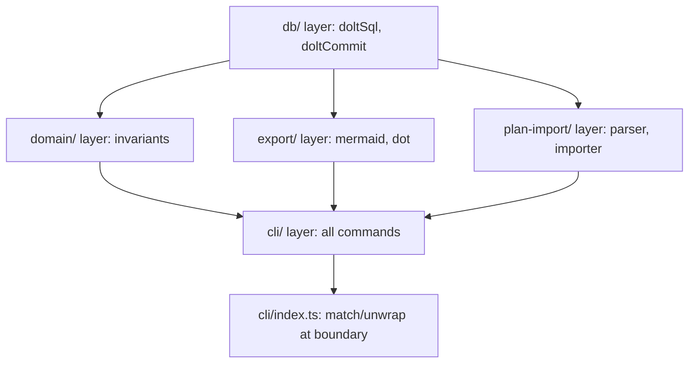
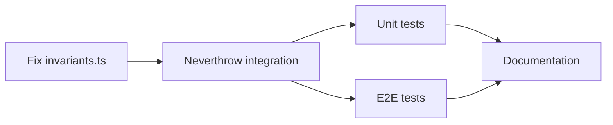

# Documentation, Testing, and Neverthrow Error Handling

## Critical Pre-requisite: Fix Corrupted File

`[tools/taskgraph/src/domain/invariants.ts](tools/taskgraph/src/domain/invariants.ts)` contains literal `\n`, `\'`, `\` escape sequences instead of proper TypeScript. This file must be rewritten from scratch before any other work begins. The logic is correct but the file is not valid TypeScript.

---

## Part 1: Neverthrow Integration

Install `neverthrow` and define a typed error system. Every function that can fail returns `Result<T, AppError>` or `ResultAsync<T, AppError>` instead of throwing.

### 1a. Define error types in a new `tools/taskgraph/src/domain/errors.ts`

```typescript
import { ResultAsync, Result, ok, err } from 'neverthrow';

export enum ErrorCode {
  // DB errors
  DB_QUERY_FAILED = 'DB_QUERY_FAILED',
  DB_COMMIT_FAILED = 'DB_COMMIT_FAILED',
  DB_PARSE_FAILED = 'DB_PARSE_FAILED',

  // Domain errors
  TASK_NOT_FOUND = 'TASK_NOT_FOUND',
  PLAN_NOT_FOUND = 'PLAN_NOT_FOUND',
  INVALID_TRANSITION = 'INVALID_TRANSITION',
  TASK_NOT_RUNNABLE = 'TASK_NOT_RUNNABLE',
  CYCLE_DETECTED = 'CYCLE_DETECTED',
  EDGE_EXISTS = 'EDGE_EXISTS',

  // Config errors
  CONFIG_NOT_FOUND = 'CONFIG_NOT_FOUND',
  CONFIG_PARSE_FAILED = 'CONFIG_PARSE_FAILED',

  // Import errors
  FILE_READ_FAILED = 'FILE_READ_FAILED',
  PARSE_FAILED = 'PARSE_FAILED',

  // Validation
  VALIDATION_FAILED = 'VALIDATION_FAILED',
}

export interface AppError {
  code: ErrorCode;
  message: string;
  cause?: unknown;
}
```

### 1b. Refactor layers bottom-up

The refactoring follows the call stack from bottom to top:




**DB layer** (`[connection.ts](tools/taskgraph/src/db/connection.ts)`, `[commit.ts](tools/taskgraph/src/db/commit.ts)`):

- `doltSql()` returns `ResultAsync<any[], AppError>` -- wraps the execa call + JSON.parse in `ResultAsync.fromPromise()`
- `doltCommit()` returns `ResultAsync<void, AppError>`

**Domain layer** (`[invariants.ts](tools/taskgraph/src/domain/invariants.ts)`):

- `checkNoBlockerCycle()` returns `Result<void, AppError>` (pure function, no async)
- `checkRunnable()` returns `ResultAsync<void, AppError>` (queries DB)
- `checkValidTransition()` returns `Result<void, AppError>` (pure function)

**Config** (`[utils.ts](tools/taskgraph/src/cli/utils.ts)`):

- `readConfig()` returns `Result<Config, AppError>`

**Export layer** (`[mermaid.ts](tools/taskgraph/src/export/mermaid.ts)`, `[dot.ts](tools/taskgraph/src/export/dot.ts)`):

- `generateMermaidGraph()` / `generateDotGraph()` return `ResultAsync<string, AppError>`

**Plan-import layer** (`[parser.ts](tools/taskgraph/src/plan-import/parser.ts)`, `[importer.ts](tools/taskgraph/src/plan-import/importer.ts)`):

- `parsePlanMarkdown()` returns `Result<ParsedPlan, AppError>`
- `upsertTasksAndEdges()` returns `ResultAsync<ImportResult, AppError>`

**CLI layer** (all command files):

- Each command action calls its chain of `Result`/`ResultAsync` operations using `.andThen()` / `.map()`
- At the CLI boundary (inside each `.action()` handler), call `.match()` to either print success output or print the error and `process.exit(1)`
- This is the **only** place `process.exit` should appear

### 1c. SQL escaping helper

Add a `tools/taskgraph/src/db/escape.ts` with a `sqlEscape(value: string): string` function that at minimum escapes single quotes. All string interpolation in queries must go through this helper. (Full parameterized queries can come later when migrating to `dolt sql-server`.)

---

## Part 2: Unit Tests (Vitest)

Install `vitest` as a dev dependency. Test configuration in `[tools/taskgraph/package.json](tools/taskgraph/package.json)` and a `vitest.config.ts`.

### Files to test (pure logic, no Dolt needed):


| File                    | Functions to test                             | Test file                              |
| ----------------------- | --------------------------------------------- | -------------------------------------- |
| `domain/invariants.ts`  | `checkNoBlockerCycle`, `checkValidTransition` | `__tests__/domain/invariants.test.ts`  |
| `domain/types.ts`       | All Zod schemas (parse valid/invalid inputs)  | `__tests__/domain/types.test.ts`       |
| `plan-import/parser.ts` | `parsePlanMarkdown`                           | `__tests__/plan-import/parser.test.ts` |
| `export/mermaid.ts`     | Mermaid string generation (mock DB)           | `__tests__/export/mermaid.test.ts`     |
| `export/dot.ts`         | DOT string generation (mock DB)               | `__tests__/export/dot.test.ts`         |
| `db/escape.ts`          | `sqlEscape`                                   | `__tests__/db/escape.test.ts`          |
| `domain/errors.ts`      | Error construction helpers                    | `__tests__/domain/errors.test.ts`      |


### Key test cases for invariants:

- `checkValidTransition`: all 5x5 status pairs (25 cases: 7 valid, 18 invalid)
- `checkNoBlockerCycle`: linear chain (ok), direct cycle A->B->A (err), transitive cycle A->B->C->A (err), `relates` edges ignored, self-edge (err)

### Key test cases for parser:

- Well-formed markdown with multiple tasks and BLOCKED_BY references
- Markdown with missing TITLE (should still parse with stableKey)
- Empty file
- File with no TASK blocks
- Acceptance list parsing

---

## Part 3: E2E Tests

E2E tests exercise the real CLI against a real Dolt instance. They use a temporary directory with `dolt init`, run the full `tg` commands via `execa`, and assert on stdout/exit codes.

Test file: `tools/taskgraph/__tests__/e2e/core-flow.test.ts`

### Core flow scenario (single test suite, sequential):

1. `tg init` -- assert exit 0, config file created, Dolt repo exists
2. `tg plan new "Auth Feature" --intent "Implement authentication"` -- assert exit 0, plan ID in stdout
3. `tg task new "Design API" --plan <planId> --feature auth --area backend` -- assert exit 0, task ID in stdout
4. `tg task new "Implement API" --plan <planId> --feature auth --area backend` -- assert exit 0
5. `tg edge add <task1Id> blocks <task2Id>` -- assert exit 0
6. `tg next` -- assert shows only task1 (task2 is blocked)
7. `tg show <task1Id>` -- assert shows task details, dependents
8. `tg start <task1Id>` -- assert exit 0
9. `tg start <task2Id>` -- assert **exit 1** (blocked, not runnable)
10. `tg done <task1Id> --evidence "Tests pass"` -- assert exit 0
11. `tg next` -- assert now shows task2 (blocker resolved)
12. `tg start <task2Id>` -- assert exit 0
13. `tg done <task2Id> --evidence "Implemented"` -- assert exit 0
14. `tg export mermaid` -- assert valid Mermaid output with both tasks as done

### Error scenario tests:

- `tg start <nonexistentId>` -- assert exit 1, error message
- `tg done <taskInTodoStatus>` -- assert exit 1 (not in doing)
- `tg edge add <A> blocks <B>` then `tg edge add <B> blocks <A>` -- assert exit 1, cycle error
- `tg show <nonexistentId>` -- assert exit 1
- Running any command before `tg init` -- assert exit 1, config not found message

### Block/split scenario:

- Create task, start it, block it on a new task, verify status
- Create task, split into 3, verify new tasks created, edges exist, original status

### Setup/teardown:

- `beforeAll`: create temp dir, run `tg init`
- `afterAll`: remove temp dir

---

## Part 4: Documentation (`/docs`)

Create the following files:

- `**docs/README.md`** -- Overview, quick-start guide, links to other docs
- `**docs/architecture.md**` -- System architecture, data flow, Dolt integration, directory structure (with mermaid diagrams)
- `**docs/schema.md**` -- Full Dolt schema reference (all 5 tables, columns, types, constraints, invariants)
- `**docs/cli-reference.md**` -- Every `tg` command with usage, options, examples, and exit codes
- `**docs/error-handling.md**` -- Error handling philosophy, `AppError` codes, Result type patterns, how errors flow from DB to CLI
- `**docs/testing.md**` -- How to run tests, test architecture, what is covered, how to add new tests
- `**docs/agent-contract.md**` -- Expanded version of AGENT.md with examples, edge cases, and decision trees
- `**docs/plan-import.md**` -- Markdown format spec for plan files, import workflow, stable keys

---

## Implementation Order

The work has natural dependencies:




1. Fix `invariants.ts` (corrupted file)
2. Add `neverthrow` + `vitest` deps, add `db/escape.ts` and `domain/errors.ts`
3. Refactor DB layer to return Result types
4. Refactor domain layer (invariants) to return Result types
5. Refactor export, plan-import, and utils layers
6. Refactor all CLI commands to use `.match()` at boundary
7. Write unit tests
8. Write e2e tests
9. Write documentation

