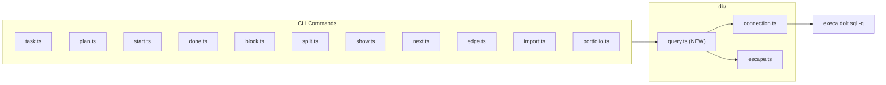

# Thin SQL Query Builder for Task-Graph

## Problem

Every CLI command manually constructs SQL via template literals with `${sqlEscape(...)}`, inline NULL ternaries, repeated datetime formatting, and hand-rolled `JSON_OBJECT(...)` strings. This is verbose, fragile (2 files miss `sqlEscape` entirely), and the `\'enum\'` escaping in `migrate.ts` exists solely to survive the execa CLI pipeline.

## Architecture

One new file: `[tools/taskgraph/src/db/query.ts](tools/taskgraph/src/db/query.ts)`. It exports a `query(repoPath)` factory that returns a builder object. The builder stays on the CLI transport (`doltSql`) -- no server, no new dependencies.




## API Design for `query.ts`

The builder provides these methods, all returning `ResultAsync<T[], AppError>`:

- `**q.insert(table, data)**` -- Takes a table name and `Record<string, SqlValue>` where `SqlValue = string | number | boolean | null | JsonObj`. Backtick-wraps the table and column names (fixing the `plan` reserved word issue). Handles NULL, datetime strings, and `JSON_OBJECT` values via a tagged type.
- `**q.update(table, data, where)**` -- Same value handling for SET clause, plus a WHERE clause from a record.
- `**q.select<T>(table, options?)**` -- Options: `columns`, `where`, `joins`, `orderBy`, `limit`, `groupBy`, `having`. Returns `ResultAsync<T[], AppError>` for typed results.
- `**q.raw<T>(sql)**` -- Escape hatch for complex queries (portfolio analytics, next command). Returns `ResultAsync<T[], AppError>`.
- `**q.count(table, where)**` -- Shortcut for `SELECT COUNT(*) FROM ...`, returns `ResultAsync<number, AppError>`.
- `**now()**` -- Exported helper: `new Date().toISOString().slice(0,19).replace("T"," ")`.
- `**jsonObj(data)**` -- Returns a tagged value that `insert`/`update` render as `JSON_OBJECT('key1', 'val1', ...)` instead of a quoted string.

### Value escaping strategy

A `formatValue(v: SqlValue)` function handles all types:

- `null` -> `NULL`
- `number` / `boolean` -> literal (no quotes)
- `string` -> `'${sqlEscape(v)}'`
- `JsonObj` (tagged) -> `JSON_OBJECT('k1', 'v1', ...)`

Table and column names are always backtick-wrapped: ``plan``, ``status``. This fixes the reserved word issue without any behavioral change.

### Example: before and after

**Before** (`task.ts`):

```typescript
const insertTaskSql = `
  INSERT INTO task (task_id, plan_id, feature_key, title, area, acceptance, created_at, updated_at)
  VALUES (
    '${sqlEscape(task_id)}',
    '${sqlEscape(options.plan)}',
    ${options.feature ? `'${sqlEscape(options.feature)}'` : "NULL"},
    '${sqlEscape(title)}',
    ${options.area ? `'${sqlEscape(options.area)}'` : "NULL"},
    ${acceptanceJson},
    '${now}',
    '${now}'
  );
`;
return doltSql(insertTaskSql, config.doltRepoPath);
```

**After**:

```typescript
const q = query(config.doltRepoPath);
return q.insert("task", {
  task_id,
  plan_id: options.plan,
  feature_key: options.feature ?? null,
  title,
  area: options.area ?? null,
  acceptance: options.acceptance ? jsonObj({ val: options.acceptance }) : null,
  created_at: now(),
  updated_at: now(),
});
```

## Escape hardening in `escape.ts`

Expand `sqlEscape` to also handle backslashes and other dangerous characters beyond just single quotes. The current `' -> ''` is insufficient -- backslash sequences can break out of string literals in MySQL-compatible parsers:

```typescript
export function sqlEscape(value: string): string {
  return value
    .replace(/\\/g, "\\\\")
    .replace(/'/g, "''")
    .replace(/\0/g, "");
}
```

## Migration of `migrate.ts`

The `\'enum\'` escaping in the SCHEMA array is unnecessary noise. The strings are static -- they don't contain JavaScript single quotes that need escaping. The `\'` sequences exist because the original author was confused about escaping layers. Since these are template literals (backtick strings), single quotes inside them are perfectly fine as-is. Clean them up to plain `'draft'` etc. No behavioral change -- the execa call passes the string as an array element, not through a shell, so single quotes in the SQL are fine.

## Files to change


| File                          | Change                                         |
| ----------------------------- | ---------------------------------------------- |
| `src/db/query.ts`             | **NEW** -- query builder                       |
| `src/db/escape.ts`            | Harden escaping                                |
| `src/db/migrate.ts`           | Remove `\'` escaping noise                     |
| `src/cli/task.ts`             | Use `q.insert`                                 |
| `src/cli/plan.ts`             | Use `q.insert`                                 |
| `src/cli/start.ts`            | Use `q.select`, `q.update`, `q.insert`         |
| `src/cli/done.ts`             | Use `q.select`, `q.update`, `q.insert`         |
| `src/cli/block.ts`            | Use `q.select`, `q.insert`, `q.update`         |
| `src/cli/split.ts`            | Use `q.insert`, `q.update`, `q.raw`            |
| `src/cli/show.ts`             | Use `q.raw` (JOINs)                            |
| `src/cli/next.ts`             | Use `q.raw`                                    |
| `src/cli/edge.ts`             | Use `q.select`, `q.insert`                     |
| `src/cli/import.ts`           | Use `q.select`, `q.insert`                     |
| `src/cli/portfolio.ts`        | Use `q.raw`                                    |
| `src/export/graph-data.ts`    | Use `q.raw` (add missing escaping)             |
| `src/domain/invariants.ts`    | Use `q.select`, `q.raw` (add missing escaping) |
| `__tests__/db/escape.test.ts` | Add tests for backslash + null byte            |
| `__tests__/db/query.test.ts`  | **NEW** -- unit tests for query builder        |


## Testing strategy

- Unit tests for `query.ts`: test `formatValue`, `insert` SQL generation, `select` SQL generation, `update` SQL generation, backtick wrapping, NULL handling, `jsonObj` rendering. These can mock `doltSql` and assert on the SQL string passed.
- Update existing escape tests for new characters.
- Existing e2e and integration tests validate end-to-end correctness after migration.

