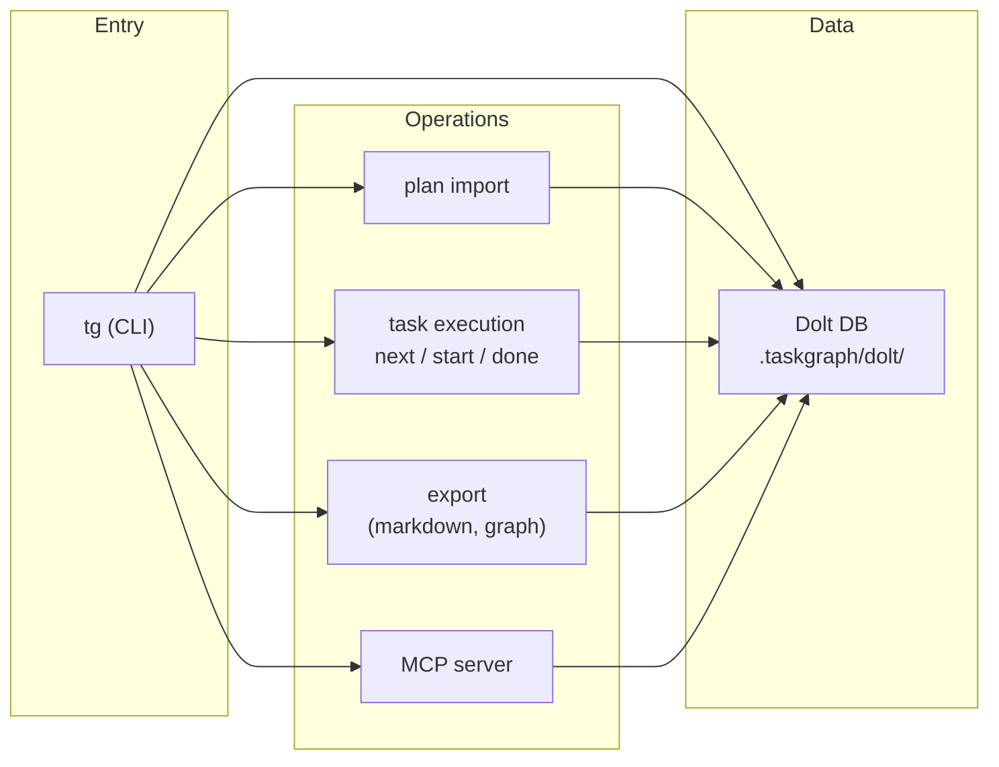

# Architecture

High-level flow and repository layout. Full detail: [docs/architecture.md](../../docs/architecture.md).

## Flow



## Layers

| Layer | Role |
|-------|------|
| **cli/** | Commander.js commands and CLI utilities; orchestrates calls to domain, db, and other layers. |
| **db/** | Dolt connection, commit, and migration; `doltSql` / `doltCommit` via `execa`. |
| **domain/** | Core business logic: types, Zod schemas, invariants, error definitions. |
| **plan-import/** | Markdown plan parsing and database import (Cursor plan format). |
| **export/** | Graph and markdown export (Mermaid, DOT, markdown). |

## Repository layout

```
src/
  cli/           # CLI entry and commands
  db/            # Dolt connection, commit, migration
  domain/        # Types, schemas, invariants
  export/        # Markdown and graph export
  plan-import/   # Plan parsing and import
.taskgraph/      # Config and Dolt repo (e.g. .taskgraph/dolt/)
plans/           # Cursor plan markdown files
docs/            # Architecture, CLI reference, plan format
.cursor/         # Agents, rules, skills, hooks
```

For configuration, branching, multi-machine sync, and error handling, see [docs/architecture.md](../../docs/architecture.md).
