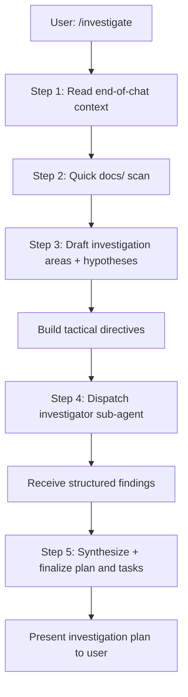

# Investigate

**Lead documentation:** See [docs/leads/investigator.md](docs/leads/investigator.md).

## Architecture

- **You (orchestrator / investigator lead)**: Reads chat context, scans docs, drafts investigation plan, dispatches investigator, synthesizes findings.
- **Sub-agents**:

  | Agent        | Purpose                                                        | Permission |
  | ------------ | -------------------------------------------------------------- | ---------- |
  | investigator | Tactical investigation (files, function chains, schemas, APIs) | read-only  |

**Constraint**: Only the investigator sub-agent is used. No other sub-agents in this skill.

## Permissions

- **Lead**: read-only
- **Propagation**: All sub-agents MUST use readonly=true.
- **Rule**: No file edits, no destructive commands. Investigator gathers evidence only.

## Decision tree



## When to use

Quick, high-level investigation that turns chat context and docs into a plan and tasks. Uses only the **investigator** sub-agent (read-only) for tactical digging.

- User says `/investigate` or "investigate what we should do next."
- User refers to a summary, post-action, or "what Cursor calls the end of the chat" to decide what to investigate.
- After sub-agents or lead have reported; you need to decide areas to investigate and concrete tasks.

## Step 1 — Context from the end of the chat

Start from the **end of the conversation** and work backward as needed:

- **Summary / post-action** — Whatever Cursor or the user treats as the "summary" or "post action" (e.g. "[work] Plan X complete", "Batch N: completed 3/5", escalation message).
- **Sub-agent / lead reports** — Recent reports from implementer, reviewer, planner-analyst, or lead: what succeeded, what failed, what was deferred, what files or areas were touched.
- **Explicit ask** — Any user instruction at the end (e.g. "investigate the status dashboard" or "figure out what's left").

From this, extract:

- **Focus** — What to investigate (e.g. "status --live and OpenTUI integration", "Dolt done/start failures").
- **Hypotheses** — Guesses about areas (e.g. "cli/status.ts", "event insert", "blocked-status sync").

## Step 2 — Quick docs/ pass

Do a **fast** high-level pass over `docs/` (no need to read every file):

- List or scan key docs (e.g. `docs/README.md`, `docs/architecture.md`, `docs/schema.md`, `docs/cli-reference.md`, `docs/skills/README.md`).
- From titles and maybe first paragraphs, guess which **areas** might need investigation (e.g. "CLI status", "task graph DB", "subagent dispatch").
- Combine with Step 1: produce a short list of **investigation areas** and, for each, a one-line **tactical directive** you will send to the investigator.

## Step 3 — Plan and tasks (draft)

From focus + hypotheses + investigation areas:

- **Plan** — One short name and 1–2 sentence scope (e.g. "Investigation: Status dashboard and Dolt events — understand failures and remaining work").
- **Tasks** — A list of **investigation tasks** (not implementation yet). Each task = one tactical directive you will give to the investigator (e.g. "Investigate status command: entrypoints, fetchStatusData and live path, and where Dolt is called for events").

Keep this draft plan and task list; you will refine it after the investigator returns.

## Step 4 — Dispatch investigator only

For each investigation task:

1. Build a **tactical directive** (what to investigate: files, function chains, ASTs, stack traces, architecture, schemas, API facades — only what's relevant).
2. Optionally add **scope** (paths/modules) and **context** (one line: why we're investigating this).
3. Call **only** the **investigator** sub-agent (read-only). Use the prompt template from `.cursor/agents/investigator.md`: `{{DIRECTIVE}}`, `{{SCOPE}}`, `{{CONTEXT}}`.
4. Do **not** call planner-analyst, implementer, or other sub-agents in this skill.

You may batch up to a few directives in one investigator run (e.g. "Investigate (a) status CLI and live path, (b) event table and insert flow") if they're closely related; otherwise one run per directive is fine.

## Step 5 — Synthesize and finalize

- Merge the **investigator's findings** (files and roles, function chains, risks, suggested follow-up tasks) into your draft.
- **Finalize the plan**: same or updated name and scope.
- **Finalize the task list**: turn the investigator's "Suggested follow-up tasks" into concrete tasks; add any tasks you inferred from findings (e.g. "Fix event insert for tg done", "Add test for status --projects when Dolt read-only").
- Present to the user: **Plan** (name + scope), **Tasks** (short titles + optional one-line intent), and **Summary** (what was investigated and what the next steps are).

## Output format

Present the result as:

```markdown
## Investigation plan: [Name]

**Scope:** [1–2 sentences]

### Investigation summary

- **Context used:** [What you took from end of chat + docs]
- **Areas investigated:** [List + one line each]
- **Key findings:** [Bullets from investigator]

### Tasks

1. [Task title] — [Optional one-line intent]
2. ...

### Next steps

[What the user should do next: e.g. "Run /work to execute these tasks" or "Review and then create a Cursor plan for implementation."]
```

## Rules

- **Context:** Start from the **end** of the chat (summary, post-action, reports); use the beginning only if needed for clarity.
- **Sub-agent:** Call **only** the **investigator** sub-agent; no other sub-agents in this skill.
- **Read-only:** The investigator does not edit or run destructive commands; you only synthesize and propose a plan and tasks.
- **Docs pass:** Quick scan of `docs/` to guess areas; do not read every doc in full unless necessary.
