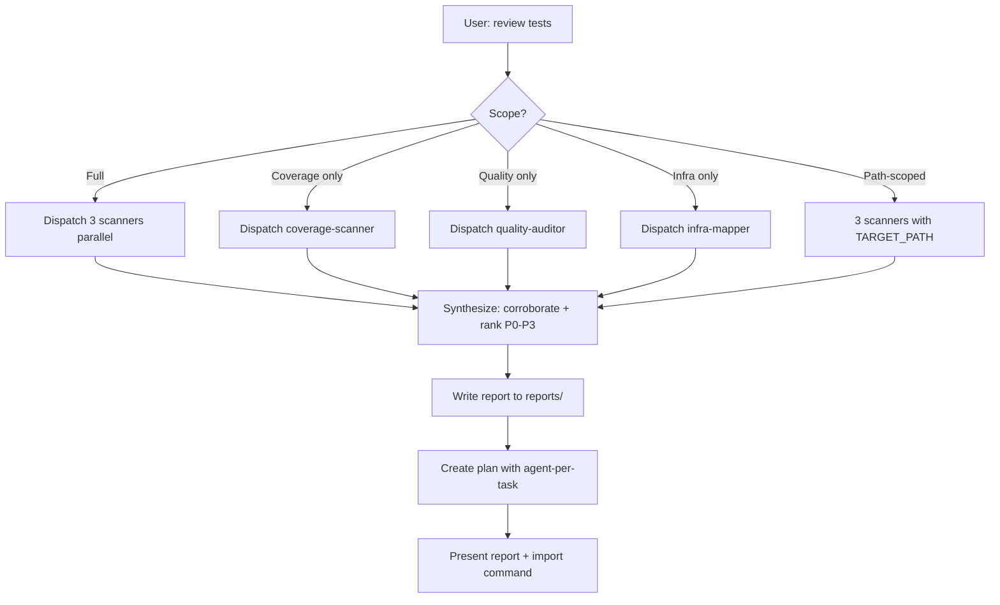

# Test Review

**Lead documentation:** See [docs/leads/test-review.md](docs/leads/test-review.md).

Orchestrates a comprehensive review of the project's testing approach by dispatching three fast subagents in parallel, synthesising their findings, writing a report, and **creating a Cursor-format plan** that can be imported into taskgraph. Each task in the plan records which sub-agent should execute it so the execution loop can run `tg start <taskId> --agent <agent>` and dispatch efficiently.

## Architecture

- **You (orchestrator)**: High-reasoning model. Coordinates dispatch, synthesises results, produces the report and the plan.
- **Subagents** (fast): Do the scanning grunt-work. Defined in `.cursor/agents/`:
  - `test-coverage-scanner` — finds untested code and coverage gaps
  - `test-quality-auditor` — evaluates test quality patterns
  - `test-infra-mapper` — maps test infrastructure and structural issues
- **Implementer** (fast): Used for remediation tasks (add tests, fix config, refactor). See `.cursor/agents/implementer.md`.

## Permissions

- **Lead**: read-write (writes report to reports/ and plan to plans/)
- **Propagation**: Phase 1 scanners MUST use readonly=true. Implementer tasks (from plan) are read-write.
- **Sub-agents**:

  | Agent                 | Permission | Phase                         |
  | --------------------- | ---------- | ----------------------------- |
  | test-coverage-scanner | read-only  | 1 (scanning)                  |
  | test-quality-auditor  | read-only  | 1 (scanning)                  |
  | test-infra-mapper     | read-only  | 1 (scanning)                  |
  | implementer           | read-write | Plan execution (after import) |

## Decision tree

## Workflow

### Phase 1: Dispatch (parallel)

Launch all three scanner subagents simultaneously via the Task tool with `model="fast"`. Each returns a structured report.

### Phase 2: Synthesise

Once all three return, merge their reports. Look for corroborating signals, conflicts (prefer quality-auditor judgement), and priority ranking (P0–P3).

### Phase 3: Report

Write the full report to `reports/test-review-YYYY-MM-DD.md`. Structure: Health Score, P0–P3 findings, Recommended Next Steps.

### Phase 4: Create a taskgraph plan

Create a Cursor-format plan at `plans/yy-mm-dd_test_review_<scope>.md` with todos; each task includes `agent` (one of the three scanners or `implementer`), `blockedBy` if needed, and `changeType`. At least two tasks have no `blockedBy` for parallel execution.

After writing the plan, give the user the import command and remind them to use `pnpm tg start <taskId> --agent <agent>` when executing.

## Scope Control

| User says                     | Scope                               |
| ----------------------------- | ----------------------------------- |
| "review tests"                | Full review (all 3 subagents)       |
| "review test coverage"        | Coverage scanner only               |
| "review test quality"         | Quality auditor only                |
| "review test infra"           | Infra mapper only                   |
| "review tests in packages/db" | All 3 subagents scoped to that path |

When scoped to a path, pass `TARGET_PATH=<path>` to the subagents.

## Reference

For detailed evaluation criteria used by each subagent, see [reference.md](reference.md).
